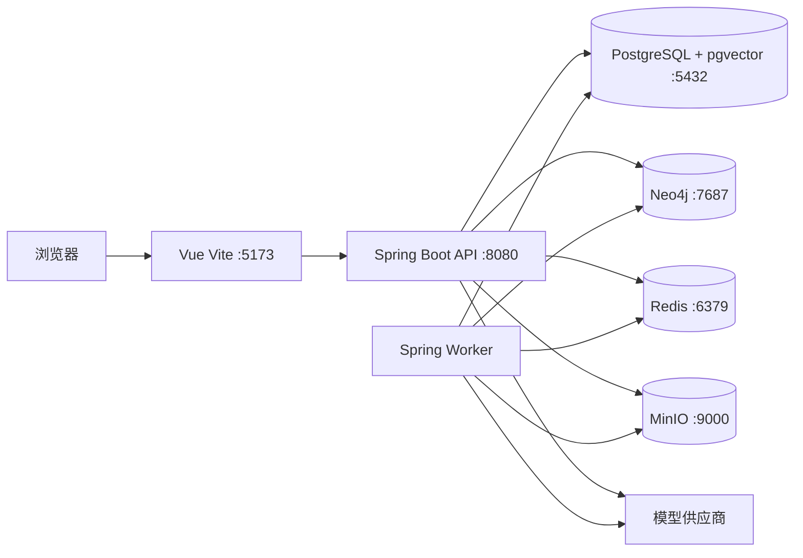

# 小说 Agent 部署与运行设计

> 文档状态：初稿  
> 目标版本：MVP 0.1  
> 技术栈：[AGENT_TECH_STACK.md](./AGENT_TECH_STACK.md)  
> 系统设计：[NOVEL_AGENT_SYSTEM_DESIGN.md](./NOVEL_AGENT_SYSTEM_DESIGN.md)  
> 测试计划：[NOVEL_AGENT_TEST_PLAN.md](./NOVEL_AGENT_TEST_PLAN.md)

## 1. 设计目标

本文定义小说 Agent 的本地开发、测试、部署、配置、监控、备份与恢复方案。

部署体系需要满足：

1. 新开发者可以用一组命令启动完整依赖。
2. PostgreSQL、pgvector、Neo4j、Redis 和对象存储职责清晰。
3. 数据库迁移、服务升级和任务 Worker 可以独立控制。
4. 模型密钥和用户手稿不进入代码仓库或容器镜像。
5. 正史数据可以备份，pgvector 和 Neo4j 可以重建。
6. 单机 MVP 不过度复杂，同时保留生产扩展路径。

## 2. 部署单元

### 2.1 MVP 进程

```text
novel-agent-web       Vue 静态资源和反向代理
novel-agent-api       Spring Boot API、认证、SSE
novel-agent-worker    Spring Boot Worker、Agent 工作流和投影任务
postgres              业务数据、正史、Outbox、pgvector
neo4j                 故事知识图谱投影
redis                 缓存、限流和短期协调
object-storage        原始文件、导出稿和大型产物
```

API 和 Worker 初期可以由同一代码库、同一镜像构建，通过运行参数启用不同角色。开发环境允许合并运行，生产环境建议分进程部署。

### 2.2 数据权威

| 组件 | 是否权威 | 数据 |
| --- | --- | --- |
| PostgreSQL | 是 | 项目、正文、版本、事实、任务、提交和 Outbox |
| 对象存储 | 是 | 原始导入文件和无法内联的大型产物 |
| pgvector | 可重建 | 与 PostgreSQL 同库的语义检索投影 |
| Neo4j | 可重建 | 关系与路径查询投影 |
| Redis | 否 | 缓存、限流、临时锁和短期状态 |

Redis、Neo4j 或向量索引丢失不能导致正史丢失。

## 3. 仓库结构

推荐单仓库：

```text
novel-agent/
├── apps/
│   ├── server/                 Spring Boot 多模块工程
│   └── web/                    Vue 3 应用
├── packages/
│   └── api-client/             OpenAPI 生成的 TypeScript 客户端
├── deploy/
│   ├── compose/
│   ├── docker/
│   ├── monitoring/
│   └── scripts/
├── docs/
├── test-data/
│   ├── fixtures/
│   └── ai-evals/
├── .env.example
├── compose.yaml
├── Makefile 或 justfile
└── README.md
```

Windows 开发环境同时提供 PowerShell 脚本，不要求用户安装 GNU Make。

## 4. 本地开发架构



本地开发建议：

- 基础设施运行在 Docker Compose。
- Java API 和 Worker 可在 IDE 中运行，便于调试。
- Vue 使用 Vite 开发服务器。
- 也提供全容器模式用于环境一致性验证。

## 5. Docker Compose

### 5.1 服务清单

| 服务 | 容器端口 | 本地端口参考 | 持久卷 |
| --- | ---: | ---: | --- |
| PostgreSQL + pgvector | 5432 | 5432 | `postgres-data` |
| Neo4j Bolt | 7687 | 7687 | `neo4j-data` |
| Neo4j Browser | 7474 | 7474 | 同上 |
| Redis | 6379 | 6379 | 可选 |
| MinIO API | 9000 | 9000 | `minio-data` |
| MinIO Console | 9001 | 9001 | 同上 |
| API | 8080 | 8080 | 无 |
| Web | 80 | 3000 | 无 |

端口仅作为默认值，均允许通过环境变量覆盖。

### 5.2 Compose 原则

- 镜像固定到明确版本，不使用 `latest`。
- 发布环境进一步固定镜像 digest。
- 每个有状态服务配置健康检查。
- API 等待数据库健康，不只等待容器启动。
- 持久卷使用明确名称，禁止开发脚本默认删除。
- 密码从 `.env` 或 Secret 注入，不硬编码在 Compose。
- 默认网络不向外暴露数据库端口；本地开发覆盖文件可以暴露。

### 5.3 Compose 文件拆分

```text
compose.yaml                 基础依赖
compose.dev.yaml             开发端口和调试配置
compose.app.yaml             API、Worker、Web
compose.observability.yaml   Prometheus、Grafana、日志组件
```

常见命令：

```powershell
docker compose -f compose.yaml -f compose.dev.yaml up -d
docker compose ps
docker compose logs -f postgres neo4j
docker compose down
```

普通 `down` 不附带 `--volumes`。清理持久数据必须使用单独脚本并要求确认。

## 6. PostgreSQL 与 pgvector

### 6.1 初始化

使用包含 pgvector 扩展的 PostgreSQL 镜像。应用迁移中执行：

```sql
CREATE EXTENSION IF NOT EXISTS vector;
```

启动后健康检查至少验证：

```sql
SELECT 1;
SELECT extversion FROM pg_extension WHERE extname = 'vector';
```

如果扩展不存在，应用应在迁移阶段失败，而不是降级为无向量模式继续运行。

### 6.2 数据库与账号

生产环境分离账号：

| 账号 | 权限 |
| --- | --- |
| `novel_migrator` | 执行 Schema 迁移，权限较高 |
| `novel_app` | 业务表读写，不创建扩展 |
| `novel_readonly` | 报表与排查只读 |
| `backup_agent` | 执行备份所需最小权限 |

API 和 Worker 可共享 `novel_app` 角色，但通过连接池名称和应用标识区分。

### 6.3 Schema

MVP 可以使用一个数据库和多个 Schema：

```text
project
importing
bible
outline
manuscript
canon
agent
projection
platform
```

如 ORM 或迁移工具对多 Schema 支持增加过多复杂度，MVP 可以使用统一 Schema 加表名前缀，但领域模块边界保持不变。

### 6.4 连接池

- API 和 Worker 使用独立 HikariCP 连接池。
- 连接池总数不得超过 PostgreSQL 可用连接预算。
- 长时间模型调用期间不持有数据库事务和连接。
- 向量批量写入使用受控批次。
- 监控活动连接、等待连接和长事务。

### 6.5 pgvector 索引

- 先完成基础数据导入，再创建或重建大型 HNSW 索引。
- 嵌入模型和维度作为索引版本的一部分。
- 新模型回填到新列、分区或索引命名空间。
- 验证召回质量后切换读取配置。
- 不在同一活动索引中混用不同维度。

## 7. Neo4j

### 7.1 运行模式

MVP 使用单实例 Neo4j。图数据是投影，因此不把 Neo4j 集群作为首版要求。

配置要求：

- Bolt 仅对 API 和 Worker 网络开放。
- Browser 在生产默认关闭或限制管理员访问。
- 初始密码通过 Secret 注入。
- 启用必要的查询日志和慢查询监控。
- 设置事务内存和查询超时。

### 7.2 约束初始化

应用提供版本化的 Neo4j 迁移或初始化脚本，负责：

- 节点复合唯一约束。
- 常用标签和版本字段索引。
- 投影元数据节点。
- 迁移版本记录。

初始化脚本必须幂等，不能依赖人工进入 Neo4j Browser 执行。

### 7.3 图谱访问

- API 只执行预定义参数化 Cypher。
- 不向前端暴露 Neo4j 凭据。
- 不接受用户提交任意 Cypher。
- 所有查询包含 `projectId` 与版本条件。
- 为深度、节点数、关系数和执行时间设置上限。

### 7.4 重建

投影重建使用新的逻辑命名空间或重建标识：

1. 冻结目标正史版本。
2. 写入新投影。
3. 验证节点、关系数量和抽样路径。
4. 补放构建期间的增量 Outbox。
5. 原子切换项目图谱读取版本。
6. 延迟清理旧投影。

## 8. Redis

Redis 仅用于：

- 短期查询缓存。
- API 限流。
- SSE 事件扇出，可选。
- 短期分布式协调，可选。
- 临时会话或撤销令牌，可选。

以下数据不得只保存在 Redis：

- 正文。
- 正史版本。
- AgentRun 权威状态。
- Outbox 事件。
- 用户审批结果。

Redis 数据全部丢失后，系统应能从 PostgreSQL 恢复核心运行。

## 9. 对象存储

### 9.1 Bucket

```text
novel-imports       原始导入文件
novel-artifacts     大型模型产物和诊断文件
novel-exports       用户导出文件
novel-backups       可选的应用级备份清单
```

生产环境可以使用云对象存储，本地开发使用 MinIO。

### 9.2 对象键

```text
projects/{projectId}/imports/{batchId}/{fileId}/original
projects/{projectId}/artifacts/{runId}/{artifactId}
projects/{projectId}/exports/{exportId}/{filename}
```

对象键使用 ID，不直接拼接用户文件名。原始文件名作为元数据保存并在下载响应中安全编码。

### 9.3 生命周期

- 原始导入文件跟随项目生命周期。
- 未完成上传分片在短期后自动清理。
- 失败模型调用的诊断产物按保留策略清理。
- 导出文件可以设置自动过期。
- Bucket 默认私有，通过后端授权或短期签名地址访问。

## 10. Java 服务运行模式

### 10.1 应用角色

同一镜像通过环境变量区分：

```text
APP_ROLE=api
APP_ROLE=worker
APP_ROLE=all
```

- `api`：HTTP、SSE、认证和同步命令。
- `worker`：工作流步骤、模型调用、Outbox 和投影。
- `all`：本地开发和轻量单机部署。

### 10.2 Spring Profile

```text
local       本地 IDE，基础设施来自 Compose
test        Testcontainers 和模型 Stub
staging     预发布真实依赖
production  生产安全配置
```

Profile 只控制环境差异，不用来开启或关闭领域规则。

### 10.3 优雅关闭

API：

- 停止接受新请求。
- 允许短请求完成。
- 关闭 SSE 前发送可重连提示，可选。

Worker：

- 停止领取新步骤。
- 对可取消步骤请求停止。
- 在终止期限内保存检查点。
- 未完成步骤保留租约，过期后由其他 Worker 接管。

## 11. Vue 应用部署

### 11.1 构建

- 使用 Node LTS 和锁文件执行可重复构建。
- TypeScript 类型检查、测试和构建必须全部通过。
- OpenAPI 客户端在构建前生成并校验无未提交差异。
- 静态资源文件名带内容哈希。
- Source Map 不公开上传到静态服务器，仅发送到受控错误平台。

### 11.2 Web 服务

生产环境由 Nginx 或等价反向代理提供：

- Vue 静态资源。
- `/api/` 代理到 API。
- SSE 禁用代理缓冲。
- 上传请求配置合理大小与超时。
- SPA 路由回退到 `index.html`。
- 安全响应头和压缩。

SSE 代理重点：

```nginx
location /api/v1/agent-runs/ {
    proxy_pass http://novel-agent-api;
    proxy_http_version 1.1;
    proxy_buffering off;
    proxy_read_timeout 1h;
}
```

具体配置在实现时根据入口网关调整。

## 12. 配置管理

### 12.1 环境变量分类

```text
APP_                 应用角色、URL、环境
DB_                  PostgreSQL
NEO4J_               Neo4j
REDIS_               Redis
OBJECT_STORAGE_      S3/MinIO
AUTH_                 认证与令牌
MODEL_                模型网关默认配置
OTEL_                 OpenTelemetry
LOG_                  日志
```

### 12.2 最小配置

```dotenv
APP_ENV=local
APP_ROLE=all
APP_PUBLIC_URL=http://localhost:5173

DB_HOST=localhost
DB_PORT=5432
DB_NAME=novel_agent
DB_USERNAME=novel_app
DB_PASSWORD=change-me

NEO4J_URI=bolt://localhost:7687
NEO4J_USERNAME=neo4j
NEO4J_PASSWORD=change-me

REDIS_HOST=localhost
REDIS_PORT=6379

OBJECT_STORAGE_ENDPOINT=http://localhost:9000
OBJECT_STORAGE_ACCESS_KEY=change-me
OBJECT_STORAGE_SECRET_KEY=change-me
OBJECT_STORAGE_BUCKET_PREFIX=novel

MODEL_DEFAULT_PROFILE=BALANCED
MODEL_PROVIDER_API_KEY=
```

`.env.example` 只放示例值，不放真实密钥。

### 12.3 密钥

生产密钥使用 Secret Manager、Kubernetes Secret 或平台提供的密钥服务：

- 数据库密码。
- Neo4j 密码。
- 对象存储密钥。
- JWT 或会话签名密钥。
- 模型供应商密钥。
- 加密密钥。

密钥不得：

- 写入 Git。
- 烘焙进容器镜像。
- 输出到日志。
- 返回浏览器。
- 出现在错误响应和健康检查中。

## 13. 模型供应商配置

模型配置保存在数据库或受控配置文件中，环境变量只提供密钥和初始默认值。

```yaml
profiles:
  FAST:
    provider: provider-a
    model: configured-model-id
    timeout: 180s
    maxOutputTokens: 4000
  BALANCED:
    provider: provider-a
    model: configured-model-id
    timeout: 300s
    maxOutputTokens: 8000
  QUALITY:
    provider: provider-b
    model: configured-model-id
    timeout: 600s
    maxOutputTokens: 16000
```

- 不把具体模型名称写死在业务代码。
- 配置修改需要版本和审计记录。
- Worker 启动时校验配置完整性。
- 供应商不可用时只使用预先批准的备选配置。

本地 Codex 部署要求：

- 后端进程用户拥有有效的 Codex 登录状态，并能访问其 `CODEX_HOME`。
- 后端管理 `codex app-server --listen stdio://` 子进程，不为每次生成重复启动 CLI。
- 小说项目 UUID 与 Codex thread ID 的映射保存在 PostgreSQL；服务重启后通过 `thread/resume` 恢复。
- 生成使用只读沙箱、关闭网络环境并禁止交互审批；Codex 只返回候选产物。
- App Server 健康、启动次数、turn 延迟、超时和异常退出进入模型运行时指标。

## 14. 数据库迁移

### 14.1 PostgreSQL

使用 Flyway：

```text
V001__enable_extensions.sql
V002__create_project_schema.sql
V003__create_manuscript_schema.sql
V004__create_agent_runtime.sql
V005__create_canon_and_outbox.sql
V006__create_vector_projection.sql
```

规则：

- 已发布迁移不可修改。
- 迁移先在备份恢复副本执行。
- 大表变更拆分为兼容的多阶段迁移。
- 创建大型索引使用适合生产的在线策略。
- 应用启动不默认以超级用户执行迁移。

### 14.2 Neo4j

维护独立迁移版本：

- 创建约束和索引。
- 新增属性和关系类型的兼容处理。
- 数据回填脚本。
- 投影重建任务。

图谱是可重建投影，破坏性 Schema 变更优先创建新投影版本，而不是原地修改全部数据。

### 14.3 应用兼容窗口

发布顺序采用扩展再收缩：

1. 数据库先新增兼容结构。
2. 发布同时兼容新旧结构的应用。
3. 完成回填并切换读取。
4. 下一版本再删除旧结构。

避免数据库迁移要求所有实例在同一瞬间升级。

## 15. 容器镜像

### 15.1 Server 镜像

- 多阶段构建。
- 构建阶段使用完整 JDK，运行阶段使用精简 JRE。
- 非 root 用户运行。
- 只复制应用产物和必要证书。
- 暴露健康检查端点。
- 设置 JVM 容器内存感知参数。

### 15.2 Web 镜像

- Node 阶段构建。
- 运行阶段只包含静态文件与 Web Server。
- 非 root 运行。
- 配置通过运行时配置文件或同源 API 提供，不把密钥写入前端环境变量。

### 15.3 供应链

- 生成 SBOM。
- 扫描基础镜像和依赖漏洞。
- 镜像签名并保存构建来源。
- 发布标签不可覆盖。
- 定期重建镜像以获取安全更新。

## 16. 健康检查

### 16.1 API

```text
/actuator/health/liveness
/actuator/health/readiness
```

Liveness 只判断进程是否能够继续运行，不因为外部模型不可用重启应用。

Readiness 检查：

- PostgreSQL 可连接。
- 必需迁移完成。
- 应用处于可接收请求状态。

Neo4j、Redis、对象存储和模型供应商以降级状态单独展示，不必全部阻止只读 API 启动。

### 16.2 Worker

Worker 健康信息包括：

- 最近领取步骤时间。
- 当前运行步骤数量。
- 数据库租约续期状态。
- Outbox 积压。
- pgvector 与 Neo4j 投影延迟。

## 17. 可观测性

### 17.1 指标

使用 Micrometer 与 OpenTelemetry 输出：

```text
HTTP 请求量、延迟和错误
数据库连接池和慢查询
AgentRun 数量、耗时和状态
工作流步骤重试和失败
模型 Token、费用、限流和延迟
Outbox 积压和最老事件年龄
向量与图投影版本延迟
SSE 连接数和重连次数
文件解析和上传失败
```

### 17.2 日志

- 结构化 JSON 日志。
- 包含 `requestId`、`runId`、`stepId` 和 `projectId`。
- 不记录完整正文、Prompt、模型密钥和认证令牌。
- 错误日志记录对象 ID、哈希、大小和安全摘要。
- 生产日志设置访问权限和保留期限。

### 17.3 Trace

跨 API、Worker、模型调用、PostgreSQL、Neo4j 和对象存储传播 Trace 上下文。模型供应商不支持上下文时，在本地调用记录中关联 `modelInvocationId`。

### 17.4 告警

P0 告警：

- 正史提交失败率异常。
- 跨项目权限检测异常。
- PostgreSQL 不可用或备份失败。
- Outbox 事件长期无法处理。
- 项目删除流程停滞。

P1 告警：

- Neo4j 或向量投影延迟超过阈值。
- 模型错误率、限流或费用异常。
- Worker 无任务处理心跳。
- 对象存储错误率升高。

## 18. 备份策略

### 18.1 PostgreSQL

- 每日完整备份。
- 持续 WAL 归档或云数据库时间点恢复。
- 备份加密并存放在独立故障域。
- 定期验证备份可读取。
- 至少每季度执行完整恢复演练；MVP 发布前至少一次。

### 18.2 对象存储

- 开启对象版本控制或等价保护。
- 对原始导入文件设置持久性策略。
- 生命周期删除必须与项目删除任务协调。
- 跨区域复制根据生产级别决定。

### 18.3 Neo4j 与 Redis

- Neo4j 可以备份以缩短恢复时间，但 PostgreSQL 仍是重建来源。
- Redis 不作为灾难恢复数据源，不要求持久备份。

### 18.4 恢复目标

MVP 初始目标：

```text
RPO: 24 小时以内，生产启用 WAL 后目标 15 分钟以内
RTO: 4 小时以内
```

目标需要通过恢复演练验证，不能只写在文档中。

## 19. 灾难恢复

### 19.1 PostgreSQL 恢复

1. 创建隔离恢复实例。
2. 恢复全量备份和 WAL。
3. 校验正史提交链、项目版本和 Outbox。
4. 切换应用只读验证。
5. 重建 pgvector 和 Neo4j 投影。
6. 验证抽样项目后恢复写入。

### 19.2 Neo4j 丢失

1. 将图谱查询状态标记为不可用。
2. 写作和审稿按策略降级或等待。
3. 从 PostgreSQL 创建全量重建任务。
4. 补放增量 Outbox。
5. 校验版本水位并恢复图查询。

### 19.3 对象存储文件丢失

数据库记录标记文件缺失，禁止返回伪造成功。尝试从对象版本或备份恢复；无法恢复时告知受影响项目、文件和功能。

## 20. 安全配置

### 20.1 网络

- PostgreSQL、Neo4j、Redis 和对象存储不直接暴露公网。
- API 是唯一业务入口。
- 管理接口使用独立网络或强认证。
- 出站网络按模型供应商和必要服务限制。

### 20.2 TLS

- 生产入口强制 HTTPS。
- 数据库跨主机连接使用 TLS。
- 对象存储使用 HTTPS。
- 内部证书自动轮换。

### 20.3 身份和会话

- 密码使用现代强哈希算法。
- 会话 Cookie 使用 `HttpOnly`、`Secure`、`SameSite`。
- API Token 有明确受众、过期时间和撤销机制。
- 高风险操作重新校验权限和近期认证状态。

### 20.4 文件处理隔离

- 解析器运行在受限临时目录或隔离进程。
- 禁止 Office 宏、外部链接和嵌入对象自动执行。
- PDF 和 DOCX 解析设置内存、CPU 和时间限制。
- 临时文件完成后安全清理。

## 21. CI/CD

### 21.1 Pull Request

```text
格式与静态检查
    ↓
Java / Vue 单元测试
    ↓
Testcontainers 集成测试
    ↓
OpenAPI 兼容检查
    ↓
核心 Playwright E2E
    ↓
构建但不发布镜像
```

### 21.2 主分支

```text
完整测试
    ↓
构建并扫描镜像
    ↓
生成 SBOM 和签名
    ↓
推送不可变镜像标签
    ↓
部署预发布
    ↓
冒烟与迁移验证
```

### 21.3 生产发布

1. 确认备份和恢复点。
2. 执行兼容性数据库扩展迁移。
3. 部署 Worker，暂缓领取新任务或使用兼容模式。
4. 滚动部署 API。
5. 发布 Web 静态资源。
6. 恢复 Worker 领取。
7. 运行冒烟测试并观察指标。
8. 完成后再执行延迟清理迁移。

失败时回退应用镜像；数据库回退优先使用前向修复，避免执行破坏性降级脚本。

## 22. 单机 MVP 部署

适合个人开发和早期内测：

```text
一台主机
├── Web
├── API + Worker
├── PostgreSQL + pgvector
├── Neo4j
├── Redis
└── MinIO
```

初始资源参考：

| 资源 | 建议 |
| --- | --- |
| CPU | 8 核 |
| 内存 | 16 GB，推荐 32 GB |
| 磁盘 | 200 GB SSD 起步 |
| JVM | 2–4 GB 堆，根据并发调整 |
| PostgreSQL | 优先保证内存与 SSD |
| Neo4j | 单独限制堆和 Page Cache |

模型主要通过外部 API 调用；如果本地部署大模型，计算资源需要单独规划，不与上述基线混为一谈。

## 23. 生产演进路径

### 阶段 A：单机内测

- Compose 运行所有组件。
- API 与 Worker 合并或分进程。
- 本地卷加外部备份。

### 阶段 B：托管数据层

- PostgreSQL 迁移到支持 pgvector 的托管服务。
- 对象存储迁移到云服务。
- API、Worker 和 Web 容器化部署。
- Neo4j 使用受控实例或托管服务。

### 阶段 C：水平扩展

- API 无状态多实例。
- Worker 按任务类型扩缩容。
- 独立模型调用并发和限流。
- 读副本承担部分只读查询。
- Redis 支撑跨实例 SSE 扇出。

### 阶段 D：高可用

- PostgreSQL 多可用区和时间点恢复。
- Neo4j 根据查询可用性要求升级集群。
- 对象存储跨区域保护。
- 灾难恢复环境和定期演练。

不要在没有真实负载前提前进入 Kubernetes 和微服务拆分。

## 24. 容量与成本

持续统计：

- 每项目正文和版本数量。
- 原始文件与产物存储量。
- 向量文档数量、维度和索引大小。
- Neo4j 节点与关系数量。
- 模型输入输出 Token 和费用。
- Agent 任务并发、排队和平均耗时。

成本控制：

- 复用相同内容哈希的嵌入。
- 对旧诊断产物设置生命周期。
- 摘要替代低价值长上下文。
- 对模型任务设置并发和项目预算。
- 冷项目可以延迟加载或重建检索投影。

## 25. 本地启动验收

新环境完成以下步骤即视为可开发：

1. 复制 `.env.example` 并填写本地值。
2. 启动基础设施 Compose。
3. PostgreSQL 健康且 `vector` 扩展存在。
4. Neo4j 约束初始化完成。
5. MinIO Bucket 自动创建。
6. API 执行 Flyway 并通过 readiness。
7. Worker 能领取测试任务。
8. Vue 可以访问 API 并建立 SSE。
9. 创建项目、保存正文和提交一次测试正史。
10. pgvector 与 Neo4j 投影水位达到该版本。

## 26. 实施顺序

### 第一步：开发环境

- 创建单仓库目录。
- Compose 启动 PostgreSQL + pgvector、Neo4j、Redis 和 MinIO。
- 环境变量模板和健康检查。
- PowerShell 启停与状态脚本。

### 第二步：应用骨架

- Spring Boot API 和 Worker 角色。
- Vue、Vite、路由和 API 客户端。
- Flyway 与 Neo4j 初始化。
- OpenTelemetry 和结构化日志。

### 第三步：构建与测试

- Server、Web 多阶段 Dockerfile。
- Testcontainers 和 Playwright。
- CI 构建、扫描和镜像产物。

### 第四步：发布能力

- 预发布部署。
- 备份、恢复和投影重建脚本。
- 指标、Dashboard 和告警。
- 滚动发布与回退流程。

## 27. 开发启动决策

文档阶段结束后，首个开发迭代按以下顺序进行：

1. 创建 `apps/server` 与 `apps/web` 工程。
2. 创建本地基础设施 Compose。
3. 实现项目创建、查询与创作意图保存。
4. 建立 `AgentRun`、`WorkflowStep` 和 SSE 骨架。
5. 实现导入文件上传与文本解析的最小链路。
6. 使用第一个端到端测试验证环境。

第一轮不同时实现全部领域表和 Agent。每完成一条垂直链路，再扩展大纲、正文生成、审稿和图谱。

---

**部署结论**：MVP 采用单仓库、模块化单体和可分离 Worker。PostgreSQL + pgvector 保存权威业务数据与向量投影，Neo4j 保存可重建图投影，Redis 只承担临时能力，对象存储保存原始文件。先用 Compose 建立可重复本地环境，再按真实负载逐步演进到托管数据层和水平扩展。
