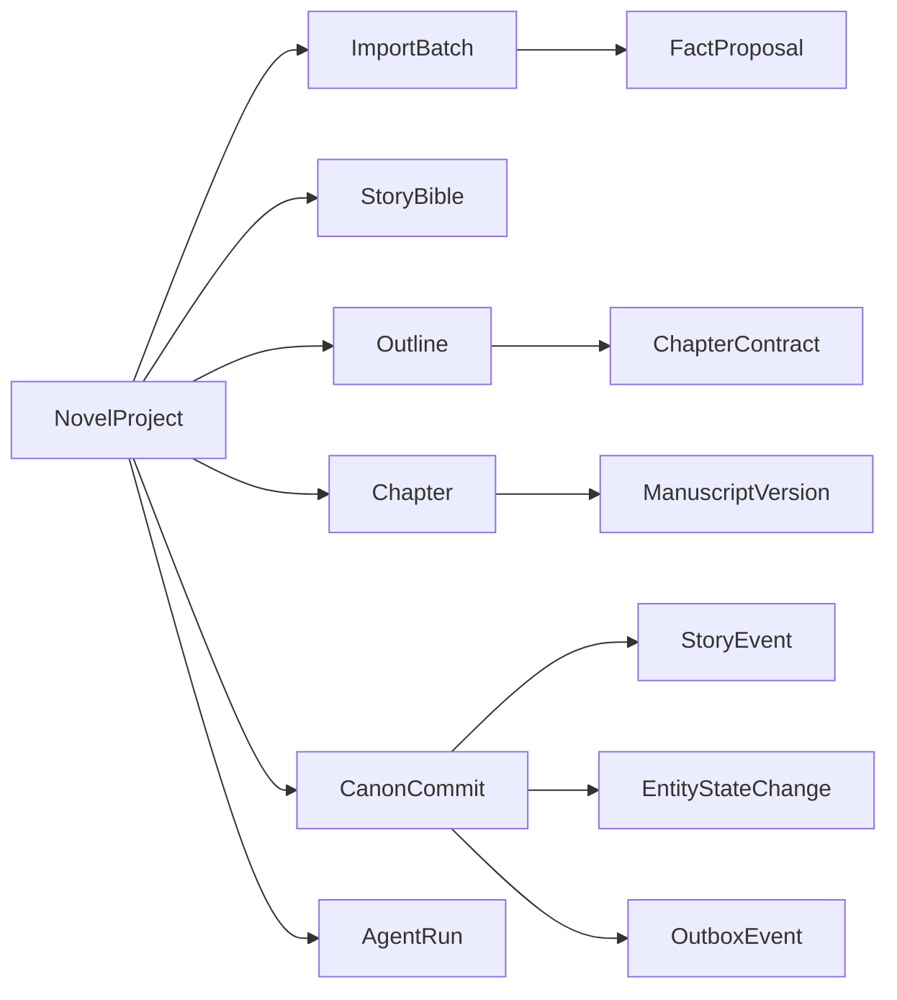
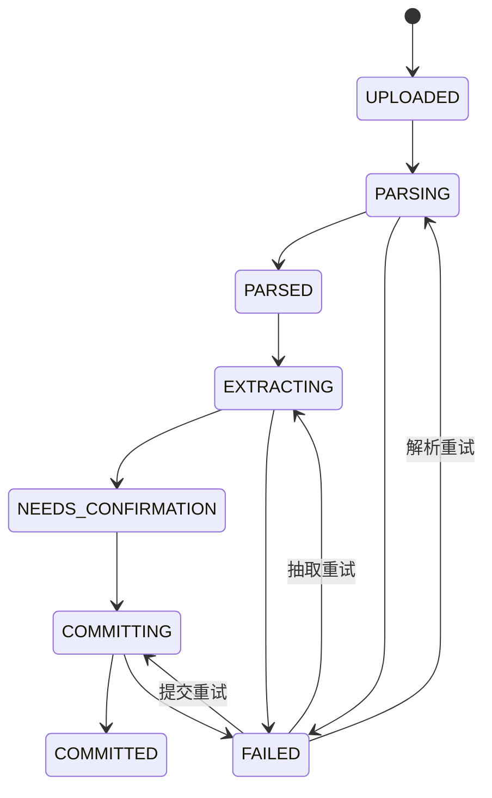
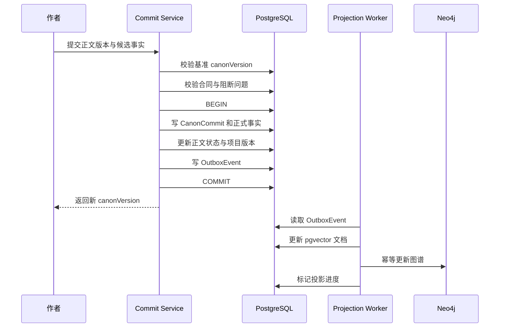
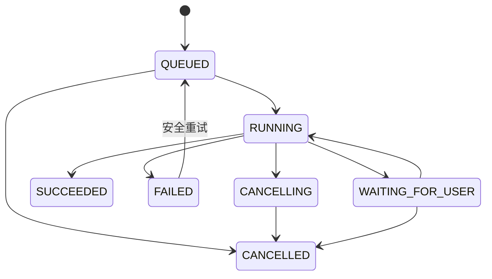

# 小说 Agent 领域模型设计

> 文档状态：初稿  
> 目标版本：MVP 0.1  
> 上游文档：[NOVEL_AGENT_MVP_REQUIREMENTS.md](./NOVEL_AGENT_MVP_REQUIREMENTS.md)  
> 系统设计：[NOVEL_AGENT_SYSTEM_DESIGN.md](./NOVEL_AGENT_SYSTEM_DESIGN.md)

## 1. 设计目标

本文将产品需求转换为可实现的领域对象、状态机和数据边界，作为数据库迁移、Java 领域代码、API 和工作流设计的共同基础。

领域模型必须保证：

1. 作者正文与 AI 草稿严格隔离。
2. 候选事实未经确认不能进入正史。
3. 正文版本、结构化事实和正史版本可以相互追溯。
4. PostgreSQL 是业务数据与正史的唯一权威源。
5. pgvector 和 Neo4j 都是可以从 PostgreSQL 重建的检索投影。
6. 所有长任务可重试，重复执行不会产生重复数据。
7. 故事时间、叙事位置和系统时间分别建模。

## 2. 统一语言

| 名称 | 定义 |
| --- | --- |
| 项目 `NovelProject` | 一部小说及其全部创作资料的隔离边界 |
| 正史 `Canon` | 经作者确认、生成时允许作为事实使用的内容集合 |
| 正史版本 `CanonVersion` | 每次成功提交后递增的项目级版本号 |
| 提交 `CanonCommit` | 将正文及其事实变化原子推进为新正史版本的操作 |
| 故事圣经 `StoryBible` | 主题、世界规则、人物核心设定等高权威资料 |
| 大纲 `Outline` | 对未来故事的可修改规划，不等同于已发生事实 |
| 章节合同 `ChapterContract` | 大纲与正文生成之间的可执行约束 |
| 手稿 `Manuscript` | 作者可见的小说正文 |
| 候选事实 `FactProposal` | AI 或导入流程抽取、尚未进入正史的结构化事实 |
| 事件 `StoryEvent` | 在故事世界中发生并引起状态变化的事实 |
| 叙事位置 `NarrativePosition` | 某事实在卷、章、场景或段落中被讲述的位置 |
| 故事时间 `StoryTime` | 事件在小说世界内部发生的时间 |
| 投影 `Projection` | 为检索而构建的 pgvector 或 Neo4j 数据副本 |
| Agent 运行 `AgentRun` | 一次可追踪、可取消、可重试的 AI 工作流实例 |

## 3. 数据所有权

### 3.1 存储职责

| 数据 | 权威存储 | 查询投影 |
| --- | --- | --- |
| 项目、成员、偏好 | PostgreSQL | 无 |
| 导入文件和解析结果 | PostgreSQL + 对象存储 | pgvector |
| 故事圣经与大纲 | PostgreSQL | pgvector、Neo4j |
| 章节、场景和正文版本 | PostgreSQL | pgvector |
| 事件、状态、关系和伏笔 | PostgreSQL | Neo4j、pgvector |
| Agent 任务和审核报告 | PostgreSQL | 无 |
| 原始文件 | S3 兼容对象存储 | 无 |
| 文本向量 | PostgreSQL `vector` 列 | HNSW 索引 |
| 图节点和图关系 | PostgreSQL 正史事件 | Neo4j |

### 3.2 唯一真相原则

- PostgreSQL 保存已经批准的正史和所有提交历史。
- Neo4j 不接受前端或写作 Agent 直接写入。
- pgvector 文档必须保留源对象 ID 和正史版本。
- Neo4j 或向量索引损坏时，可以从 PostgreSQL 和对象存储重建。
- 检索投影落后不影响正文提交，但必须暴露同步状态。

## 4. 聚合边界



推荐聚合根：

| 聚合根 | 内部对象 | 事务边界 |
| --- | --- | --- |
| `NovelProject` | 创作偏好、当前正史版本 | 项目配置更新 |
| `ImportBatch` | 文件、解析单元、抽取候选 | 单次导入确认 |
| `StoryBible` | 版本、规则、人物核心设定 | 故事圣经发布 |
| `Outline` | 卷、章、场景计划 | 大纲版本发布 |
| `Chapter` | 场景、手稿版本、章节合同 | 草稿保存与版本创建 |
| `CanonCommit` | 正文提交、事实变化、Outbox | 正史原子提交 |
| `AgentRun` | 步骤、模型调用、上下文快照 | 工作流状态推进 |

聚合之间只通过稳定 ID 关联，不在 Java 对象中加载整张对象图。

## 5. 标识、版本与通用字段

### 5.1 标识规则

- 数据库主键统一使用 UUID v7，兼顾全局唯一和索引局部性。
- 对用户展示的编号单独生成，例如 `CH-0018`，不得作为外键。
- PostgreSQL、Neo4j、向量文档使用相同的稳定业务 ID。
- 不把角色姓名、章节标题或 Neo4j 内部 ID 作为跨系统标识。

### 5.2 通用字段

业务表按需要包含：

```text
id                 UUID 主键
project_id         项目隔离键
version            乐观锁版本
created_at         创建时间
created_by         创建者
updated_at         更新时间
updated_by         更新者
deleted_at         软删除时间，可选
```

正史相关记录额外包含：

```text
canon_version_from 首次生效的正史版本
canon_version_to   失效版本，NULL 表示当前有效
source_type        MANUAL / IMPORT / AGENT / SYSTEM
source_id          来源对象 ID
source_ref         可定位到章节、场景或段落的引用
```

### 5.3 三种版本

| 版本 | 范围 | 用途 |
| --- | --- | --- |
| `row_version` | 单行 | 乐观锁，防止覆盖并发编辑 |
| `content_version` | 单个文档或对象 | 正文、大纲、故事圣经的修订历史 |
| `canon_version` | 整个项目 | 标识一次完整、可追溯的正史快照 |

三者不得混用。保存正文草稿只增加内容版本；只有批准提交才增加项目正史版本。

## 6. 项目与创作意图

### 6.1 NovelProject

| 字段 | 类型 | 说明 |
| --- | --- | --- |
| `id` | UUID | 项目 ID |
| `owner_id` | UUID | 所有者 |
| `name` | varchar(200) | 项目名称 |
| `entry_mode` | enum | `IDEA`、`MANUSCRIPT`、`MATERIALS` |
| `status` | enum | `ACTIVE`、`ARCHIVED`、`DELETING` |
| `current_canon_version` | bigint | 当前正史版本，从 0 开始 |
| `current_outline_version_id` | UUID | 当前采用的大纲版本 |
| `current_bible_version_id` | UUID | 当前采用的故事圣经版本 |
| `settings` | jsonb | 非核心可扩展设置 |
| `row_version` | bigint | 乐观锁版本 |

### 6.2 CreativeIntent

核心字段：

- 一句话创意 `premise`。
- 类型 `genres`。
- 目标读者 `target_audience`。
- 主角简述 `protagonist_brief`。
- 核心冲突 `central_conflict`。
- 故事基调 `tones`。
- 目标字数 `target_words`。
- 结局倾向 `ending_preference`。
- 必须出现内容 `must_have`。
- 禁止内容 `avoid`。
- 参考作品的抽象偏好 `style_preferences`。

创作意图允许持续修改，但已经进入正文的重大变更应触发影响分析，而不是静默替换。

## 7. 导入领域模型

### 7.1 对象关系

```text
ImportBatch
├── ImportFile
│   └── ParsedUnit
└── ExtractionProposal
    ├── EntityProposal
    ├── EventProposal
    ├── RelationProposal
    └── OutlineProposal
```

### 7.2 ImportBatch

| 字段 | 说明 |
| --- | --- |
| `id` | 导入批次 ID |
| `project_id` | 所属项目 |
| `purpose` | `MANUSCRIPT`、`OUTLINE`、`SETTING`、`MIXED` |
| `status` | 导入状态 |
| `parser_version` | 解析器版本 |
| `extractor_version` | 抽取流程版本 |
| `confirmed_at` | 用户确认时间 |
| `committed_canon_version` | 最终写入的正史版本，可为空 |

### 7.3 ImportFile

| 字段 | 说明 |
| --- | --- |
| `storage_key` | 对象存储位置 |
| `original_name` | 原始文件名 |
| `media_type` | MIME 类型 |
| `size_bytes` | 文件大小 |
| `sha256` | 去重与完整性校验 |
| `parse_status` | 文件级解析状态 |
| `text_content_id` | 解析文本引用 |

### 7.4 ParsedUnit

`ParsedUnit` 是保留原文顺序的解析单元，可表示卷、章、场景、段落、设定条目或未知片段。

关键字段：

```text
unit_type, ordinal, title, content,
source_page, source_offset_start, source_offset_end,
parent_unit_id, classification_confidence
```

用户对章节拆分、合并和重命名的结果单独保存，不覆盖原始解析结果。

### 7.5 导入状态机



状态迁移必须记录失败阶段，不能从 `FAILED` 猜测恢复位置。

## 8. 故事圣经与实体

### 8.1 StoryBibleVersion

故事圣经采用不可变版本：

| 字段 | 说明 |
| --- | --- |
| `id` | 版本 ID |
| `project_id` | 所属项目 |
| `version_no` | 内容版本号 |
| `status` | `DRAFT`、`PROPOSED`、`PUBLISHED`、`SUPERSEDED` |
| `theme` | 主题表达 |
| `genre_contract` | 类型承诺 |
| `world_summary` | 世界概述 |
| `ending_direction` | 结局方向 |
| `based_on_version_id` | 来源版本 |

发布新版本不会重写历史版本。项目通过 `current_bible_version_id` 指向当前版本。

### 8.2 StoryEntity

所有故事实体共享基础身份：

```text
StoryEntity
├── Character
├── Location
├── Organization
├── Item
├── Secret
└── WorldRule
```

基础字段：

| 字段 | 说明 |
| --- | --- |
| `entity_type` | 实体类型 |
| `display_name` | 当前显示名 |
| `aliases` | 别名列表 |
| `summary` | 简介 |
| `attributes` | 类型特有的扩展属性 |
| `authority` | `LOCKED`、`CANON`、`PLANNED`、`INFERRED` |
| `locked_fields` | 作者锁定、Agent 不得修改的字段 |

MVP 可以采用“公共实体表 + 类型详情表”，不要把所有业务字段永久塞入一个 JSONB。

### 8.3 CharacterProfile 与 CharacterState

角色的稳定档案和随剧情变化的状态分开：

```text
CharacterProfile
├── identity
├── personality
├── voice
├── background
├── long_term_desire
└── locked_traits

CharacterState
├── story_time
├── location_id
├── physical_state
├── emotional_state
├── current_goal
└── inventory
```

`CharacterState` 是带有效期的正史记录，不直接覆盖旧状态。查询当前状态时选择目标正史版本和故事时间内有效的记录。

### 8.4 CharacterKnowledge

| 字段 | 说明 |
| --- | --- |
| `character_id` | 知识持有者 |
| `fact_key` | 稳定事实标识 |
| `knowledge_type` | `WITNESSED`、`LEARNED`、`BELIEVED`、`SUSPECTED` |
| `truth_status` | `TRUE`、`FALSE`、`UNKNOWN` |
| `learned_event_id` | 获知该信息的事件 |
| `valid_from_story_time` | 开始知道的故事时间 |
| `confidence` | 角色自身确信程度 |

客观事实与角色认知不能共用一条记录。角色可以坚定地相信错误信息。

## 9. 大纲与章节合同

### 9.1 OutlineVersion

大纲版本是不可变快照，编辑中的内容保存在草稿版本：

```text
OutlineVersion
└── OutlineNode
    ├── BOOK
    ├── ARC
    ├── CHAPTER
    └── SCENE
```

`OutlineNode` 通过 `parent_id` 和 `ordinal` 形成树。主要字段：

- `node_type`。
- `title`。
- `summary`。
- `objective`。
- `conflict`。
- `outcome`。
- `planned_story_time`。
- `suggested_min_words` 与 `suggested_max_words`，仅作为容量参考，不要求树节点逐级精确相加。
- `status`：`PLANNED`、`WRITING`、`COMPLETED`、`ABANDONED`。

### 9.2 ChapterContract

章节合同属于具体章节和大纲版本，发布后不可原地修改。

| 字段 | 说明 |
| --- | --- |
| `chapter_id` | 目标章节 |
| `outline_version_id` | 来源大纲版本 |
| `contract_version` | 合同版本 |
| `pov_character_id` | POV 角色 |
| `objective` | 本章目标 |
| `story_time` | 计划故事时间 |
| `location_ids` | 允许出现的主要地点 |
| `required_beats` | 必须发生的节拍 |
| `required_reveals` | 必须揭示的信息 |
| `forbidden_facts` | 禁止提前揭示的事实 |
| `expected_exit_state` | 章节结束状态 |
| `foreshadow_actions` | 埋设、强化或回收计划 |
| `hook` | 结尾钩子 |
| `target_words` | 目标字数 |
| `hard_constraints` | 机器阻断的约束 |

生成任务必须冻结合同 ID、合同版本和起始正史版本，以便复现。

## 10. 手稿与版本

### 10.1 层级

```text
NovelProject
└── Volume
    └── Chapter
        └── Scene
            └── ManuscriptVersion
```

MVP 中正文可按章节保存，场景作为可选结构；但检索切块和引用必须能够定位到段落。

### 10.2 Chapter

主要字段：

- `volume_id`、`ordinal`、`title`。
- `status`：`PLANNED`、`DRAFTING`、`IN_REVIEW`、`CANON`、`ARCHIVED`。
- `current_draft_version_id`。
- `current_canon_version_id`。
- `active_contract_id`。
- `story_time_start`、`story_time_end`。
- `pov_character_id`。

### 10.3 ManuscriptVersion

正文版本不可变：

| 字段 | 说明 |
| --- | --- |
| `chapter_id` | 所属章节 |
| `version_no` | 章节内递增版本 |
| `content` | 正文内容或文档结构 |
| `content_hash` | 完整性与重复检测 |
| `origin` | `AUTHOR`、`IMPORT`、`AGENT`、`MERGED` |
| `base_version_id` | 基于哪个版本创建 |
| `agent_run_id` | AI 生成时的运行 ID |
| `status` | `DRAFT`、`IN_REVIEW`、`CANON`、`SUPERSEDED` |

自动保存可以写入可变的编辑缓冲区；明确保存版本时才创建 `ManuscriptVersion`，避免每次按键产生新版本。

## 11. 正史事实模型

### 11.1 StoryEvent

事件是状态变化和因果关系的中心：

| 字段 | 说明 |
| --- | --- |
| `event_type` | 事件类型 |
| `summary` | 事实化摘要 |
| `story_time_start/end` | 故事时间范围 |
| `chapter_id/scene_id` | 叙事位置 |
| `location_id` | 发生地点 |
| `importance` | 重要度 |
| `status` | 候选或正史状态 |
| `evidence_ref` | 正文证据 |

参与者、前因、后果不塞入 JSON 数组，分别使用关联表：

- `event_participant`。
- `event_causality`。
- `event_entity_ref`。

### 11.2 EntityStateChange

状态变化使用明确的前后值：

```json
{
  "entityId": "char_linche",
  "fieldPath": "relationship.trust.char_guyao",
  "before": 72,
  "after": 41,
  "eventId": "evt_0128",
  "evidenceRef": "chapter_18:paragraph_34"
}
```

`field_path` 必须来自受控字段目录，不能允许模型任意创造语义重复的字段名。

### 11.3 StoryRelation

PostgreSQL 保存关系正史记录，Neo4j 保存其查询投影。

关键字段：

```text
source_entity_id, target_entity_id, relation_type,
properties, valid_from_story_time, valid_to_story_time,
canon_version_from, canon_version_to, evidence_ref
```

关系类型由项目无关的字典管理，例如 `TRUSTS`、`LOVES`、`OWNS`、`MEMBER_OF`、`KNOWS_SECRET`。自定义关系先映射到通用类型，并把展示名称保存在属性中。

### 11.4 Foreshadow

| 字段 | 说明 |
| --- | --- |
| `title` | 伏笔名称 |
| `description` | 内容与预期效果 |
| `lifecycle_status` | `PLANNED`、`PLANTED`、`REINFORCED`、`PARTIALLY_REVEALED`、`RESOLVED`、`ABANDONED` |
| `planned_resolve_from/to` | 计划回收区间 |
| `actual_resolve_event_id` | 实际回收事件 |
| `related_entity_ids` | 相关实体，通过关联表实现 |

每次状态变化保存 `foreshadow_transition`，不得只覆盖当前状态。

### 11.5 FactProposal

AI 抽取结果统一进入候选模型：

| 字段 | 说明 |
| --- | --- |
| `proposal_type` | `ENTITY_UPSERT`、`EVENT_CREATE`、`STATE_CHANGE`、`RELATION_CHANGE`、`KNOWLEDGE_CHANGE`、`FORESHADOW_CHANGE` |
| `payload` | 通过对应 JSON Schema 验证的候选数据 |
| `confidence` | 模型置信度，仅作辅助 |
| `evidence_refs` | 一个或多个原文证据 |
| `decision` | `PENDING`、`ACCEPTED`、`EDITED`、`REJECTED` |
| `decided_by/at` | 决策人和时间 |
| `target_id` | 提交后生成或更新的正式对象 |

低置信度不是拒绝依据，高置信度也不能跳过人工确认。

当前 `chapter-review/2` 为兼容审核界面，除类型化 `payload` 外仍保留可读的 `subject`、`predicate`、`object` 和单段 `evidence`。历史 `chapter-review/1` 没有 `payload`，读取时允许为空；新模型输出必须通过类型与 payload 匹配校验。

## 12. 正史提交

### 12.1 CanonCommit

一次提交包含：

- 基准正史版本。
- 提交后的新正史版本。
- 一个正文版本，可选。
- 接受的候选事实集合。
- 手工创建的事实变化。
- 审稿报告和未解决警告。
- 提交说明与操作者。

### 12.2 提交事务



### 12.3 强制不变量

提交服务必须保证：

1. `expectedCanonVersion` 必须等于项目当前版本。
2. 正文版本属于当前项目和目标章节。
3. 所有候选事实均已接受或编辑确认。
4. `ERROR` 级审核问题未解决时禁止自动提交。
5. 新正史版本严格等于当前版本加一。
6. 正文、事实、提交记录和 Outbox 在一个 PostgreSQL 事务中写入。
7. 同一个 `idempotencyKey` 只能产生一次提交。

## 13. Agent 运行模型

### 13.1 AgentRun

| 字段 | 说明 |
| --- | --- |
| `run_type` | `IMPORT`、`PLAN`、`WRITE`、`REVIEW`、`EXTRACT`、`REINDEX` |
| `status` | 运行状态 |
| `target_type/target_id` | 目标对象 |
| `input_canon_version` | 运行时冻结的正史版本 |
| `input_outline_version_id` | 冻结的大纲版本 |
| `input_contract_id` | 冻结的章节合同 |
| `idempotency_key` | 幂等键 |
| `requested_by` | 发起人 |
| `started_at/finished_at` | 执行时间 |
| `error_code/error_message` | 失败信息 |

### 13.2 运行状态机



### 13.3 WorkflowStep

每一步保存：

- `step_type` 和顺序。
- 输入与输出对象引用。
- 状态、开始时间、结束时间和重试次数。
- Prompt 版本、模型调用 ID 和工具调用 ID。
- 可恢复检查点。

运行成功不等于内容进入正史。生成结果仍处于草稿或候选状态。

### 13.4 ContextSnapshot

为了复现生成结果，保存：

- 查询计划。
- 使用的正史版本。
- 召回对象 ID、来源和评分。
- 最终注入的文本与 Token 数量。
- 被预算淘汰的候选 ID。

正文内容可按项目隐私策略加密或设置保留期限，但对象 ID 和运行元数据应长期保留。

## 14. 向量文档模型

### 14.1 VectorDocument

建议表名 `vector_document`：

| 字段 | 类型 | 说明 |
| --- | --- | --- |
| `id` | UUID | 向量文档 ID |
| `project_id` | UUID | 项目过滤条件 |
| `source_type` | varchar | `SCENE`、`SUMMARY`、`ENTITY`、`EVENT`、`RULE` 等 |
| `source_id` | UUID | 来源对象 |
| `source_version` | bigint | 来源内容版本 |
| `chunk_no` | int | 同一来源内的块序号 |
| `content` | text | 用于检索和证据展示的文本 |
| `content_hash` | varchar | 避免重复计算向量 |
| `embedding` | vector(n) | 维度由嵌入模型决定 |
| `embedding_model` | varchar | 模型名称和版本 |
| `canon_version` | bigint | 对应正史版本 |
| `metadata` | jsonb | 章节、场景、POV、标签等过滤字段 |
| `status` | enum | `ACTIVE`、`SUPERSEDED`、`FAILED` |

唯一约束建议：

```text
(project_id, source_type, source_id, source_version, chunk_no, embedding_model)
```

向量维度不能在同一索引中随意混用。更换嵌入模型时创建新的索引版本，完成回填后再切换读取别名。

### 14.2 切块规则

- 优先按场景、段落和语义边界切块。
- 角色、规则和事件使用独立结构化文本模板生成向量。
- 每块保留前后邻接块 ID。
- 摘要向量与正文向量使用不同 `source_type`。
- 禁止把未确认候选事实写入默认正史索引。

## 15. Neo4j 图模型

### 15.1 节点标签

```text
:Project
:Character
:Location
:Organization
:Item
:Secret
:WorldRule
:Event
:Foreshadow
:Chapter
:Scene
```

所有业务节点至少包含：

```text
projectId, entityId, displayName,
canonVersionFrom, canonVersionTo, status, sourceRef
```

### 15.2 关系类型

```text
(:Character)-[:TRUSTS|LOVES|HATES|KNOWS]->(:Character)
(:Character)-[:MEMBER_OF]->(:Organization)
(:Character)-[:LOCATED_AT]->(:Location)
(:Character)-[:OWNS]->(:Item)
(:Character)-[:PARTICIPATED_IN|WITNESSED]->(:Event)
(:Character)-[:KNOWS_SECRET|BELIEVES]->(:Secret)
(:Event)-[:CAUSED_BY|CAUSES]->(:Event)
(:Event)-[:OCCURRED_AT]->(:Location)
(:Event)-[:CHANGES]->(:Character|:Item|:Organization)
(:Foreshadow)-[:PLANTED_IN|REINFORCED_IN|RESOLVED_IN]->(:Chapter)
(:Scene)-[:PART_OF]->(:Chapter)
```

动态关系必须带故事有效期、来源和正史版本。静态分类关系也必须带 `projectId`，避免跨项目路径污染。

### 15.3 投影规则

- `entityId` 和 `relationId` 作为幂等合并键。
- 收到更新事件时，不物理删除历史关系，而是关闭有效版本。
- 同步器记录每个项目已完成的最高 `canonVersion`。
- 一个版本的所有图事件处理完成后，才推进项目图投影水位。
- 查询必须限定 `projectId` 和目标版本有效区间。
- 图投影可整体删除并从正史事件重新构建。

### 15.4 MVP 查询

第一版必须支持：

1. 查询角色当前直接关系。
2. 查询角色在某故事时间已知的秘密。
3. 查询两个事件之间的因果路径。
4. 查询物品的历任持有者。
5. 查询章节涉及的角色、事件和伏笔。
6. 查询某实体变化会影响的未来章节和未回收伏笔。

## 16. Outbox 与投影进度

### 16.1 OutboxEvent

| 字段 | 说明 |
| --- | --- |
| `id` | 事件 ID，同时作为消费幂等键 |
| `project_id` | 项目 ID |
| `canon_version` | 正史版本 |
| `aggregate_type/id` | 来源聚合 |
| `event_type` | 事件类型 |
| `payload` | 版本化事件数据 |
| `status` | `PENDING`、`PROCESSING`、`PROCESSED`、`FAILED` |
| `attempts` | 尝试次数 |
| `available_at` | 下次可执行时间 |
| `processed_at` | 完成时间 |

事件类型示例：

```text
CANON_COMMITTED
MANUSCRIPT_PUBLISHED
ENTITY_UPSERTED
EVENT_UPSERTED
RELATION_CHANGED
FORESHADOW_CHANGED
SOURCE_SUPERSEDED
PROJECT_DELETED
```

### 16.2 ProjectionCheckpoint

分别记录 `VECTOR` 和 `NEO4J` 投影：

```text
project_id, projection_type,
last_complete_canon_version,
last_event_id, status, updated_at, error_message
```

上下文组装器可以选择等待目标版本投影完成，或降级为 PostgreSQL 结构化查询，但必须把降级信息记录到运行上下文。

## 17. PostgreSQL 逻辑表清单

MVP 建议按模块创建以下表，不代表必须一次完成所有字段：

### project

- `novel_project`
- `creative_intent`
- `project_setting`

### importing

- `import_batch`
- `import_file`
- `parsed_unit`
- `fact_proposal`
- `proposal_evidence`

### bible

- `story_bible_version`
- `story_entity`
- `character_profile`
- `character_state`
- `character_knowledge`
- `world_rule`

### outline

- `outline_version`
- `outline_node`
- `chapter_contract`

### manuscript

- `volume`
- `chapter`
- `scene`
- `editing_buffer`
- `manuscript_version`

### canon

- `canon_commit`
- `canon_commit_item`
- `story_event`
- `event_participant`
- `event_causality`
- `entity_state_change`
- `story_relation`
- `foreshadow`
- `foreshadow_transition`

### agent

- `agent_run`
- `workflow_step`
- `model_invocation`
- `tool_invocation`
- `context_snapshot`
- `review_report`
- `review_issue`

### projection

- `vector_document`
- `outbox_event`
- `projection_checkpoint`

## 18. 删除与恢复

### 18.1 软删除

项目内实体默认软删除，以便历史正文和提交仍能解释。删除已进入正史的实体，本质上是创建新的失效版本。

### 18.2 项目彻底删除

项目彻底删除按以下顺序执行：

1. 将项目置为 `DELETING`，停止新任务。
2. 删除或匿名化模型调用日志中的正文。
3. 删除对象存储文件。
4. 删除 pgvector 文档。
5. 按 `projectId` 删除 Neo4j 子图。
6. 删除 PostgreSQL 项目数据。
7. 写入不含正文的删除审计结果。

步骤需要幂等并支持续跑。

### 18.3 回滚

回滚不是数据库时间倒流，而是创建一个新提交：

- 指定要恢复的历史正文和事实快照。
- 计算从当前版本到目标快照的反向差异。
- 用户确认差异。
- 创建新的 `CanonCommit` 和更大的正史版本。

这样可以保留完整历史，不会让已经生成的引用失去解释依据。

## 19. 领域服务

推荐的核心领域服务：

| 服务 | 职责 |
| --- | --- |
| `ImportService` | 建立导入批次、解析文件、管理确认 |
| `CanonAuthorityService` | 比较事实权威和识别冲突 |
| `OutlineService` | 发布大纲版本、生成章节合同 |
| `ManuscriptService` | 草稿保存、正文版本和合并 |
| `CanonCommitService` | 校验并执行正史原子提交 |
| `StoryStateService` | 查询指定版本与故事时间下的状态 |
| `KnowledgeBoundaryService` | 判断角色在指定时点可知的信息 |
| `ContextAssemblyService` | 混合检索、过滤、重排和预算分配 |
| `AgentRunService` | 创建、推进、取消和恢复工作流 |
| `ProjectionService` | 消费 Outbox，更新向量和图谱投影 |

领域服务返回明确结果对象，不直接返回模型生成的任意 JSON。

## 20. 实现顺序

### 第一步：最小持久化骨架

- `novel_project`、`creative_intent`。
- `chapter`、`editing_buffer`、`manuscript_version`。
- `agent_run`、`workflow_step`。
- `canon_commit`、`outbox_event`。

### 第二步：导入闭环

- `import_batch`、`import_file`、`parsed_unit`。
- `fact_proposal` 与证据。
- 导入确认和第一次正史提交。

### 第三步：规划与生成

- 故事圣经、大纲树和章节合同。
- 向量文档和上下文快照。
- 写作草稿、审稿报告和正文 Diff。

### 第四步：长期记忆

- 事件、人物状态、知识边界、关系和伏笔。
- Neo4j 投影与混合检索。
- 投影重建和版本一致性检查。

## 21. 待在后续文档确定的问题

以下内容不在领域模型中提前锁死：

- REST API 路径、请求和响应结构。
- SSE 事件名称与前端进度协议。
- 各 Agent 的 Prompt 和 JSON Schema 细节。
- 嵌入模型、向量维度和模型路由规则。
- 富文本正文采用 HTML、JSON 文档还是 Markdown 存储。
- 工作流首版采用自研状态机还是引入专用引擎。

这些问题分别在 API、工作流、AI 和 UI 设计文档中确定。

---

**领域模型结论**：PostgreSQL 持有全部业务事实与版本历史，pgvector 在同库中提供语义检索，Neo4j 提供可重建的关系查询投影。所有 AI 内容先成为草稿或候选，只有 `CanonCommitService` 能够在人工确认后推进项目正史版本。
