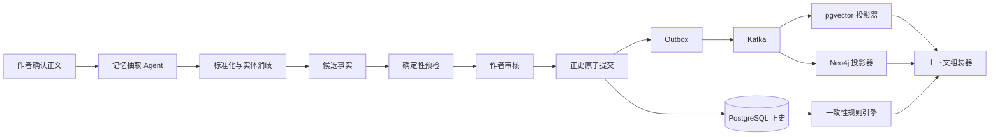

# 小说 Agent 长篇记忆与一致性实现方案

> 本文把系统设计中的人物状态、角色知识、物品流转、事件因果、伏笔生命周期、确定性连续性检查、全项目扫描，以及 pgvector/Neo4j 投影重建细化为可执行的工程方案。PostgreSQL 是唯一正史源；pgvector 和 Neo4j 均为可重建的查询投影。

## 1. 目标与当前基线

当前系统已经具备：

- 正文、审稿和候选事实的版本化保存。
- 用户逐项接受或拒绝候选事实。
- 正文、接受事实、正史版本和 Outbox 的 PostgreSQL 原子提交。
- Kafka 发布正史事件，pgvector 与 Neo4j 独立消费和记录检查点。
- 按章节摘要、正文片段和相关图谱事实组装长期记忆，并执行 Token 预算。

当前 `canon_commit.accepted_facts` 仍是事实快照 JSONB，Neo4j 也主要投影通用事实。下一步需要把接受事实物化为可查询、可校验、可追溯的 PostgreSQL 正史记录，同时保留 JSONB 快照以兼容旧提交和便于审计。

本文不改变以下原则：

1. 模型只提出候选，不直接修改正史。
2. PostgreSQL 保存事实和版本，Neo4j 不成为第二真相源。
3. 正文提交成功不依赖投影同步成功。
4. 所有当前状态都能从历史变化记录重算，不能只保存最后一个值。
5. 故事时间、叙事位置、正史版本和系统时间分别建模。

## 2. 总体处理链路



章节写作前读取目标 `canonVersion` 的状态；章节完成后只产生候选变化。用户提交后，新事实从 `canonVersion + 1` 开始生效。生成过程冻结输入正史版本，运行期间出现的新提交不会悄悄进入当前 Prompt。

## 3. PostgreSQL 权威模型

### 3.1 公共约束

所有正史对象至少包含：

```text
id, project_id, canon_version_from, canon_version_to,
story_time_from, story_time_to, status,
source_commit_id, evidence_ref, created_at
```

- `canon_version_to IS NULL` 表示在当前正史中仍有效。
- 正史恢复不删除旧记录，而是创建新版本并关闭被替代记录的有效区间。
- `story_time_*` 首版同时保存可排序键和作者展示文本。无法精确排序时标记 `UNRESOLVED`，不得伪造时间顺序。
- `evidence_ref` 使用稳定定位，例如 `manuscript:{versionId}:paragraph:34`。
- 模型输出的名称必须先解析为稳定 `entity_id`；歧义项停留在候选状态。

### 3.2 实体与人物状态

新增核心表：

| 表 | 用途 |
| --- | --- |
| `story_entity` | 人物、地点、组织、物品、秘密、规则的稳定身份 |
| `entity_alias` | 别名及生效范围，辅助实体消歧 |
| `character_profile` | 人物稳定档案与作者锁定字段 |
| `entity_state_change` | 任意受控状态字段的前后变化 |
| `character_state_snapshot` | 按提交生成的读取优化快照，可重建 |

`entity_state_change.field_key` 只能取自代码维护的字段目录：

```text
character.location
character.physical_state
character.emotional_state
character.current_goal
character.alive_status
item.location
item.holder
item.condition
relation.trust
```

字段目录定义值类型、允许的实体类型、是否单值、是否允许空值和比较器。模型提供未知字段时转成待映射候选，不能直接入库。

状态读取算法：

1. 限定 `project_id` 和目标 `canonVersion`。
2. 排除在目标故事时间之后才发生的变化。
3. 按故事时间、叙事顺序、正史版本排序。
4. 从最近快照开始依次应用变化。
5. 返回最终值、来源事件和证据，而不只返回裸值。

### 3.3 角色知识边界

角色知识与客观事实分开保存：

| 表 | 关键字段 |
| --- | --- |
| `story_fact` | `fact_key`、客观真值、权威级别、证据 |
| `character_knowledge` | `character_id`、`fact_id`、`knowledge_type`、`belief_truth`、`confidence` |
| `knowledge_transition` | 获知、怀疑、误信、纠正、遗忘的变化历史 |

`knowledge_type` 使用 `WITNESSED`、`LEARNED`、`BELIEVED`、`SUSPECTED`。`belief_truth` 表示人物认知是否符合客观事实，人物可以确信一个错误结论。

POV 上下文只允许包含：

- 该人物在本章故事时间前已亲历或已获知的信息。
- 该人物的主观信念，包括错误信念，但必须标注为主观认知。
- 作者允许的叙述者知识；第一人称和限知第三人称默认禁止全局秘密。

规则引擎发现正文明确陈述了 POV 无权知道的事实时，产生 `KNOWLEDGE_LEAK`。模型审稿用于理解含蓄表达，代码负责时间与权限的硬判断。

### 3.4 事件、时间线与因果

新增：

| 表 | 用途 |
| --- | --- |
| `story_event` | 事件摘要、故事时间、叙事位置、地点与重要度 |
| `event_participant` | 参与者、角色和参与方式 |
| `event_entity_ref` | 事件涉及的物品、组织、秘密和规则 |
| `event_causality` | `CAUSES`、`ENABLES`、`MOTIVATES`、`PREVENTS` |

`event_causality` 不允许跨项目，不能指向不存在或晚于结果发生的直接原因。故事时间不确定时允许保存关系，但标记 `TEMPORAL_UNVERIFIED` 并进入告警。

时间线 API 以 PostgreSQL 为准；Neo4j 用于多跳影响查询，例如“该事件经过两跳影响了哪些人物和伏笔”。

### 3.5 物品流转

物品使用 `story_entity(type=ITEM)` 表示，持有与位置通过状态变化记录：

```text
item.holder:  char_a -> char_b
item.location: loc_room -> loc_station
item.condition: intact -> damaged
```

确定性约束：

- 同一故事时间，一个普通物品只能有一个直接持有人和一个位置。
- 转移必须说明来源；当前持有人与 `before` 不一致时阻断提交。
- 若设定允许复制、分身或集合物品，必须在实体档案中明确 `multiplicity`，不能由模型临时推断。
- 人物携带物品移动时，物品位置可以派生，不强制为每次移动创建重复变化。

### 3.6 伏笔生命周期

新增：

| 表 | 用途 |
| --- | --- |
| `foreshadow` | 标题、目标效果、计划回收区间和当前状态 |
| `foreshadow_transition` | 每次埋设、强化、揭示、回收或放弃 |
| `foreshadow_entity_ref` | 相关人物、事件、物品和秘密 |

合法状态转换：

```text
PLANNED -> PLANTED -> REINFORCED -> PARTIALLY_REVEALED -> RESOLVED
PLANTED/REINFORCED/PARTIALLY_REVEALED -> ABANDONED
```

允许重复 `REINFORCED`。越过中间状态需要作者明确确认。到达计划回收章节仍未解决时产生 `FORESHADOW_OVERDUE` 警告，不自动改写正文或伏笔状态。

## 4. 候选事实与原子提交

### 4.1 候选类型

记忆抽取 Agent 使用联合 Schema 输出：

```text
ENTITY_UPSERT
EVENT_CREATE
STATE_CHANGE
RELATION_CHANGE
KNOWLEDGE_CHANGE
FORESHADOW_CHANGE
```

每个候选必须携带 `proposalId`、类型化 payload、证据范围、置信度和可能匹配的实体 ID。服务端执行 JSON Schema、项目归属、实体引用、字段目录、状态机和时间规则校验。

### 4.2 提交顺序

正史提交事务按以下顺序执行：

1. 锁定项目并校验 `expectedCanonVersion`。
2. 校验正文、审稿和候选均属于同一项目与章节。
3. 重新运行阻断级确定性规则，避免预览后状态变化。
4. 创建 `canon_commit` 和新正史版本。
5. 物化接受的实体、事件、状态、关系、知识与伏笔变化。
6. 更新正文正史状态和可选状态快照。
7. 写入只包含 ID 与版本的 Outbox 事件。
8. 提交 PostgreSQL 事务。

任何一步失败都整体回滚。pgvector 和 Neo4j 更新不在事务内。

### 4.3 幂等与旧数据迁移

- `fact_proposal` 使用稳定 ID，提交明细对 `(commit_id, proposal_id)` 建唯一约束。
- `canon_commit` 增加 `idempotency_key` 唯一约束。
- 投影写入使用 `(project_id, source_id, canon_version)` 或稳定 `relation_id` 幂等。
- 旧 `accepted_facts JSONB` 通过一次迁移任务转换为类型化记录；无法可靠映射的内容保留为 `LEGACY_FACT`，等待人工整理。
- 迁移前后对每个项目比较提交数、事实数和证据引用，不能静默丢弃旧事实。

## 5. 确定性连续性规则引擎

### 5.1 职责边界

规则引擎处理可计算约束，模型处理语义和文学判断：

| 代码规则 | 模型审稿 |
| --- | --- |
| 人物是否已死亡、是否在场 | 动机是否自然 |
| 物品是否由该人物持有 | 动作描写是否可信 |
| POV 是否有权知道某事实 | 暗示是否构成越权泄漏 |
| 事件时间是否逆序 | 倒叙表达是否清楚 |
| 伏笔是否逾期或非法跳转 | 回收是否令人满意 |
| 世界规则硬约束是否违反 | 设定呈现是否生硬 |

### 5.2 规则接口

```java
public interface ContinuityRule {
    String code();
    RuleSeverity defaultSeverity();
    boolean supports(ConsistencyContext context);
    List<ConsistencyIssue> evaluate(ConsistencyContext context);
}
```

`ConsistencyContext` 包含冻结的正史版本、故事时间、章节合同、候选正文、抽取候选、相关实体状态和证据，不允许规则自行读取“最新版本”造成竞态。

首批规则：

| 规则码 | 默认级别 | 检查内容 |
| --- | --- | --- |
| `CHARACTER_LOCATION_CONFLICT` | `BLOCKING` | 同时出现在不可能抵达的地点 |
| `CHARACTER_LIFE_STATE_CONFLICT` | `BLOCKING` | 死亡人物无解释地正常行动 |
| `ITEM_HOLDER_CONFLICT` | `BLOCKING` | 使用或转移未持有物品 |
| `KNOWLEDGE_LEAK` | `BLOCKING` | POV 提前知道秘密或事件 |
| `STORY_TIME_CONFLICT` | `BLOCKING` | 明确时间顺序自相矛盾 |
| `WORLD_RULE_CONFLICT` | `BLOCKING` | 违反作者锁定的世界规则 |
| `RELATION_TRANSITION_GAP` | `WARNING` | 关系突变缺少事件依据 |
| `FORESHADOW_OVERDUE` | `WARNING` | 超过计划区间仍未处理 |
| `CAUSALITY_GAP` | `WARNING` | 关键结果没有可定位原因 |

规则结果必须包含 `ruleCode`、严重级别、正文范围、冲突事实 ID、双方证据、说明和建议。只有 `BLOCKING` 阻止正史提交；作者可以在有权限并填写理由后显式接受风险。

### 5.3 两次检查

- **生成前**：发现章节合同本身已与正史冲突，避免浪费模型调用。
- **提交前**：联合检查正文抽取结果和当前正史，防止把冲突写入权威数据。

模型审稿发现的结构化问题与规则问题按 `ruleCode + sourceRange + factId` 去重，保留不同证据来源。

## 6. 全项目一致性扫描

全项目扫描不是把全文一次性交给模型，而是分层执行：

1. `STRUCTURAL`：SQL 检查版本区间、孤立引用、重复当前状态和非法状态转换。
2. `TEMPORAL`：按事件时间和章节顺序检查人物、物品、知识与因果。
3. `GRAPH`：Neo4j 检查断裂关系、循环因果、无法解释的知识传播路径。
4. `SEMANTIC`：只将疑似冲突的证据小包交给模型复核。
5. `AGGREGATE`：合并问题，生成项目、实体、章节三个维度的报告。

扫描任务冻结目标 `canonVersion`，支持按项目、章节范围、实体或规则码增量执行。每个问题保存扫描版本；后续正史变化后标记 `STALE`，不能继续冒充当前结论。

建议接口：

```text
POST /api/v1/projects/{projectId}/consistency-scans
GET  /api/v1/projects/{projectId}/consistency-scans/{scanId}
GET  /api/v1/projects/{projectId}/consistency-issues
PATCH /api/v1/projects/{projectId}/consistency-issues/{issueId}
```

状态使用 `QUEUED`、`RUNNING`、`WAITING_FOR_MODEL`、`SUCCEEDED`、`FAILED`、`CANCELLED`。长任务由 Agent 运行时承载，并通过 SSE 报告阶段进度。

## 7. pgvector 投影与检索

### 7.1 投影文档

`semantic_document` 扩展为分块与版本模型：

```text
source_type, source_id, chunk_id, project_id,
canon_version_from, canon_version_to,
story_time_from, story_time_to, pov_character_id,
summary, content, content_hash,
embedding_model, embedding_dimensions, embedding,
status, metadata
```

索引对象包括章节摘要、场景正文、人物阶段状态、事件、规则和伏笔。相同 `content_hash + embedding_model` 复用向量。

当前本地特征哈希实现继续作为开发降级方案；正式环境接入语义 Embedding 后，采用新命名空间并行回填，验证完成再切换读取模型，避免原地混用不同向量空间。

### 7.2 召回流程

1. 从章节合同提取实体、POV、时间、事件与主题需求。
2. SQL 查询硬约束和当前状态。
3. Neo4j 查询直接关系、知识和因果邻域。
4. pgvector 召回语义片段。
5. 按项目、正史版本、故事时间和 POV 权限过滤。
6. 去重、重排并按统一 Token 预算组装。

任何向量结果都不能覆盖结构化正史。向量投影不可用时降级到 SQL + Neo4j；Neo4j 不可用时降级到 SQL + pgvector；PostgreSQL 权威查询失败时停止生成。

## 8. Neo4j 投影

### 8.1 节点与关系

节点使用 `Character`、`Location`、`Organization`、`Item`、`Event`、`Secret`、`Rule` 和 `Foreshadow`。首批关系：

```text
PARTICIPATED_IN, OCCURRED_AT, CAUSED_BY,
LOCATED_AT, HOLDS, MEMBER_OF,
KNOWS_SECRET, LEARNED_FROM,
TRUSTS, LOVES, HATES,
FORESHADOWS, RESOLVES, CONTRADICTS
```

节点和关系必须携带 `projectId`、稳定业务 ID、正史有效区间、故事时间有效区间和来源提交 ID。所有 Cypher 查询首先限定 `projectId`，再限定目标版本。

### 8.2 消费顺序与完整版本

一个正史版本的图投影按以下顺序执行：

1. Upsert 实体节点。
2. Upsert 事件和伏笔节点。
3. Upsert 关系及有效期。
4. 关闭被替代关系。
5. 校验关系端点和事件数量。
6. 将项目 `graph_complete_version` 推进到该版本。

读取只能使用不高于 `graph_complete_version` 的版本，不能把只同步了一半的新图当成完整结果。

## 9. 投影重建与失败重放

### 9.1 失败重放

在现有 `projection_checkpoint` 基础上增加：

```text
projection_failure(event_id, projection_type, attempts,
                   next_retry_at, error_code, error_message,
                   first_failed_at, last_failed_at, status)
```

- 临时网络错误指数退避自动重试。
- Schema、数据损坏和权限错误进入 `DEAD_LETTER`，等待人工处理。
- 重放仍使用原事件 ID，依靠检查点和目标端唯一约束保证幂等。
- 一个投影失败不阻止另一个投影推进，但项目状态必须分别展示。

管理接口：

```text
GET  /api/v1/projects/{projectId}/projection-status
GET  /api/v1/admin/projection-failures
POST /api/v1/admin/projection-failures/{eventId}/actions/replay
```

### 9.2 全量重建

重建流程：

1. 创建 `projection_rebuild_job`，冻结目标正史版本。
2. 从 PostgreSQL 权威表分页读取数据。
3. 写入新的向量命名空间或 Neo4j 重建批次。
4. 比较实体、事件、关系、向量块数量并抽样校验内容哈希。
5. 补放冻结版本之后产生的增量 Outbox。
6. 原子切换项目读取版本。
7. 延迟清理旧投影。

重建不能清空在线投影后原地慢慢恢复。重建失败时继续使用旧投影，并保留失败报告。

建议接口：

```text
POST /api/v1/projects/{projectId}/projections/{type}/actions/rebuild
GET  /api/v1/projects/{projectId}/projection-rebuilds/{jobId}
POST /api/v1/projects/{projectId}/projection-rebuilds/{jobId}/actions/cancel
```

## 10. 后端模块划分

在现有模块化单体中新增：

```text
com.novelagent.storyworld
├── domain          StoryEntity、StoryEvent、StateChange、Knowledge、Foreshadow
├── application     状态查询、候选标准化、时间线、事实提交
├── infrastructure  JPA Repository、字段目录、Neo4j 查询
└── api             故事资料、时间线、人物状态接口

com.novelagent.consistency
├── domain          ContinuityRule、ConsistencyIssue
├── application     章节预检、提交前检查、全项目扫描
├── rules           位置、物品、知识、时间、世界规则、伏笔规则
└── api             扫描与问题接口

com.novelagent.projection
├── application     重放、重建、状态聚合
├── vector          pgvector 投影
├── graph           Neo4j 投影
└── api             投影管理接口
```

Kafka Consumer 只接收事件并调用应用服务，不在监听器内堆积领域逻辑。规则引擎依赖 PostgreSQL 端口接口，不直接依赖 Neo4j，保证图谱故障时仍能守住正史提交边界。

## 11. 前端能力

故事资料页包含：

- 人物档案、当前状态和状态历史。
- “人物知道什么”与其证据来源。
- 物品当前位置、持有人和流转历史。
- 事件时间线和因果关系。
- 伏笔状态、计划回收区间和逾期告警。

创作工作台增加：

- 生成前冲突提示。
- 本次生成使用的证据列表。
- 审稿问题定位到正文范围。
- 正史提交前的状态、关系和伏笔 Diff。

系统状态页增加投影版本、积压事件、失败原因和重建进度。普通作者只显示“正常、同步中、需处理”，技术细节放在展开区域。

## 12. 测试策略

### 12.1 领域测试

- 状态在故事时间和正史版本两个维度正确生效。
- 错误信念不改变客观事实。
- 物品转移不会产生两个当前持有人。
- 伏笔非法状态转换被拒绝。
- 正史恢复创建新版本且历史仍可查询。

### 12.2 规则测试

每条规则至少包含：正常、明确冲突、时间不确定、证据不足和作者接受风险五类样例。固定测试小说覆盖倒叙、多 POV、假死、误导信息、物品转交和伏笔延迟回收。

### 12.3 投影测试

- 同一 Kafka 事件重复消费不产生重复节点、关系或向量块。
- pgvector 成功而 Neo4j 失败时，状态分别记录。
- 从空投影重建后的数量、内容哈希和抽样查询与 PostgreSQL 一致。
- 重建期间的新提交不会丢失。
- Neo4j 超时后写作可降级，PostgreSQL 失败时停止生成。

### 12.4 验收场景

连续提交至少 20 章后，系统应能：

1. 查询任一章开始时人物位置、身体状态、目标和持有物。
2. 判断 POV 是否有权知道某个秘密并给出获知证据。
3. 展示关键物品完整流转链。
4. 展示事件的直接前因、后果和相关伏笔。
5. 阻止明确的死亡状态、位置、物品持有和知识泄漏冲突。
6. 扫描全项目并把问题定位到事实和正文证据。
7. 删除 Neo4j 与向量投影后，从 PostgreSQL 完整重建并恢复查询。

## 13. 实施顺序

### 迭代一：类型化正史

- 已完成：通过 `V011` 新增实体、通用事实、事件、状态变化、关系、知识和伏笔表。
- 已完成：建立首批人物状态字段目录；未知状态字段只保留通用事实，不猜测映射。
- 已完成：正史提交在原事务中物化可确定的类型化事实，同时保留旧 JSONB 快照。
- 已完成：提供实体、当前状态、事件时间线和伏笔只读接口。
- 已完成：审稿候选事实使用六种事实类型的联合 Schema，携带置信度、故事时间和类型化 payload。
- 已完成：稳定 ID、标准名称、确认别名和显式新实体的确定性解析，并记录每次已确认提及。
- 已完成：审稿时把章节相关实体、确认别名和近期提及排序目录加入同一次模型调用，模型可以建议稳定 ID，作者可在审稿界面改选。
- 已完成：接受事实中的未解析代词会阻止审稿确认。
- 待完成：段落级共指评分、独立歧义候选持久化和伏笔状态迁移校验。
- 待完成：物品流转专用接口及旧提交回填任务。

验收：接受的候选事实可以在 PostgreSQL 中按项目、正史版本和故事时间查询。

### 迭代二：确定性一致性

- 实现首批九条连续性规则。
- 接入生成前和提交前两次检查。
- 审稿界面合并模型问题与规则问题。

验收：明确的位置、死亡、物品、知识和时间冲突无法无提示进入正史。

### 迭代三：完整图谱与向量投影

- Neo4j 投影类型化节点、关系和版本水位。
- pgvector 扩展多类语义文档和正式 Embedding 接口。
- 上下文组装增加 SQL、图谱、向量混合召回和 POV 过滤。

验收：生成 Prompt 中的状态、知识、关系与历史片段都能定位来源，并遵守目标正史版本。

### 迭代四：扫描、重放与重建

- 全项目一致性扫描。
- 投影失败表、自动重试、人工重放。
- pgvector 与 Neo4j 双缓冲全量重建。
- 系统状态和故事资料页面。

验收：投影可以删除后重建，失败可观察、可重试，连续 20 章测试项目通过长篇一致性验收。

## 14. 完成定义

这组能力只有同时满足以下条件才算完成：

- PostgreSQL 中存在可查询、可回溯的类型化正史，而不只是 JSONB 和图谱副本。
- 写作上下文按故事时间、正史版本和 POV 知识边界过滤。
- 硬冲突由确定性规则阻断，文学质量交给模型辅助判断。
- 每条状态和关系都能回到正文证据与正史提交。
- pgvector 和 Neo4j 失败不会破坏正史，并且都能从 PostgreSQL 重建。
- 全项目扫描不依赖一次性把整本小说发送给模型。
