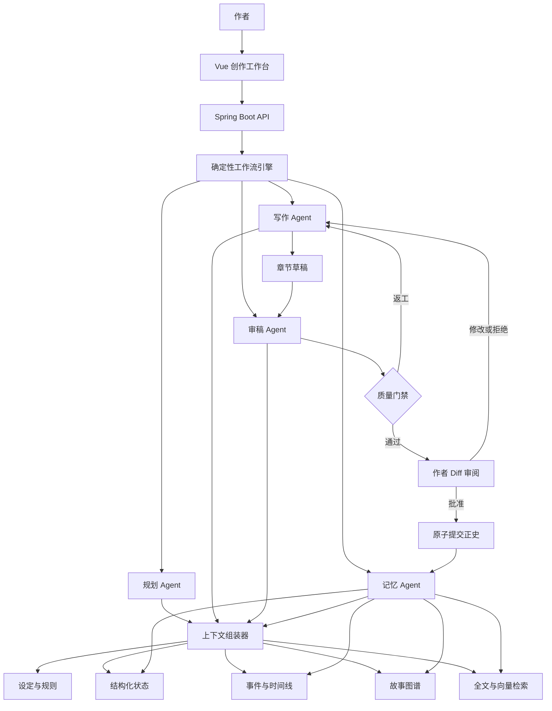
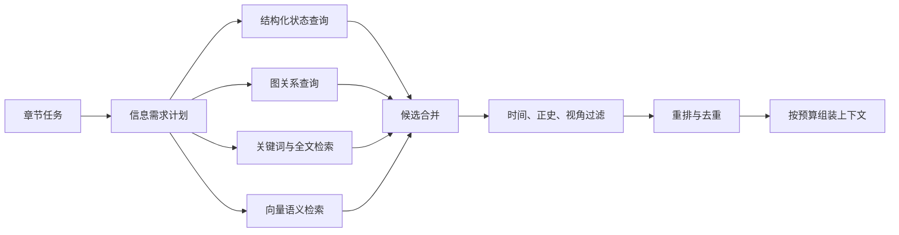
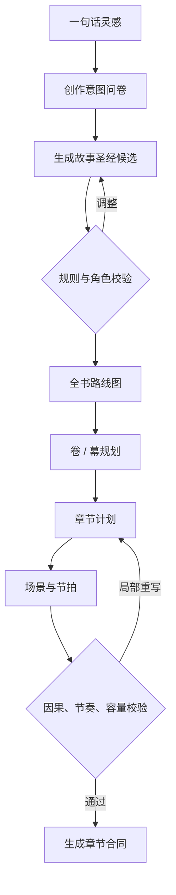

# 小说 Agent 系统设计方案

> 本文面向长篇小说创作系统的产品设计与工程实现，重点回答：系统如何规划故事、维护长期记忆、组织多 Agent 协作，并在作者可控的前提下持续生成高质量正文。

## 文档导航

- 长篇人物状态、知识边界、物品流转、事件因果、伏笔、一致性扫描和投影重建的工程细节见 [长篇记忆与一致性实现方案](NOVEL_AGENT_LONG_FORM_MEMORY_IMPLEMENTATION.md)。

| 读者 | 建议优先阅读 |
| --- | --- |
| 产品与创作者 | 第 1、2、7、8、10、12 节 |
| 后端开发 | 第 2 至 9、11、12 节 |
| 前端开发 | 第 8、10、11 节 |
| AI 应用开发 | 第 3 至 8、11 节 |

## 1. 关键决策

### 1.1 产品定位

小说 Agent 不是一个加了长 Prompt 的聊天机器人，而是一套能够长期维护创作事实、规划故事、生成正文、发现问题、返工修订，并允许作者随时介入的生产系统。

首版产品定位为：**作者可控的长篇小说创作工作台**，而不是无人值守的一键百万字生成器。

系统需要解决六个核心问题：

1. 记住已经确认的世界观、人物、时间线和剧情事实。
2. 把一句灵感逐层展开为可执行的大纲和章节任务。
3. 生成正文时只注入当前真正需要的上下文。
4. 写完后抽取人物状态、事件因果、关系变化和伏笔进度。
5. 在提交正文前发现冲突、越权知识、节奏和文风问题。
6. 让所有 AI 修改都可审阅、可追踪、可撤销、可恢复。

### 1.2 技术决策摘要

| 主题 | 推荐决策 | 理由 |
| --- | --- | --- |
| Agent 编排 | Spring AI Alibaba Agent Graph；确定性工作流为主，Agent 自主决策为辅 | 长篇创作需要可恢复、可复现、可审计 |
| 后端 | Java 21、Spring Boot 3.5、Spring AI 1.1、Spring AI Alibaba 1.1.2.2 | 使用稳定兼容线，适合业务建模、工作流和企业级服务治理 |
| 前端 | Vue 3、TypeScript、Vite、Pinia、TipTap | 适合构建编辑器、状态面板和 Diff 工作台 |
| 主数据库 | PostgreSQL | 保存权威事实、版本、任务和结构化故事状态 |
| 向量检索 | 首版使用 pgvector | 降低部署复杂度，与业务数据保持事务一致性 |
| 图谱 | 首版直接引入 Neo4j | 原生表达角色关系、事件因果、知识传播和多跳查询，避免后续迁移图模型 |
| 工作流 | MVP 用数据库状态机；复杂后升级 Temporal 或 Camunda | 先验证产品，再引入重型基础设施 |
| 模型接入 | 统一模型网关，支持多供应商与按任务选模 | 平衡质量、成本、延迟和可用性 |
| 事实提交 | 草稿隔离、审核后原子提交 | 防止错误内容污染长期记忆 |
| 检索 | 结构化查询、图查询、全文检索和向量检索融合 | 单一向量召回无法可靠处理时间和关系约束 |

### 1.3 设计原则

1. **正史优先**：已确认事实高于大纲，正文高于模型推断。
2. **生成与提交分离**：AI 可以提出候选修改，但不能静默改写正史。
3. **结构化状态优先**：人物位置、持有物、关系和时间线不依赖自然语言回忆。
4. **上下文按需组装**：不把整本书塞进上下文窗口。
5. **证据可追溯**：关键检索结果必须保留来源和版本。
6. **工作流可恢复**：每一步有输入、输出、状态、模型参数和检查点。
7. **作者拥有最终决定权**：大纲、设定、正文和记忆变更均支持人工覆盖。

### 1.4 首版非目标

- 无人值守地生成整部长篇并自动发布。
- 同时支持所有小说类型和所有出版流程。
- 为展示效果堆叠大量自由协商的 Agent。
- 一开始就引入独立向量数据库、消息队列和微服务全家桶；Neo4j 作为核心图谱组件除外。
- 自动训练专属大模型或承担复杂版权判定。

## 2. 总体架构



### 2.1 核心运行闭环

每一章都遵循同一条受控生产链：

`读取章节合同 -> 制定检索计划 -> 组装上下文 -> 生成草稿 -> 多维审稿 -> 返工或人工确认 -> 提交正史 -> 更新记忆与索引`

大模型负责语义理解、创意和文本生成；业务代码负责状态转换、权限边界、版本提交、检索过滤和失败恢复。关键业务约束不能只写在 Prompt 中。

### 2.2 建议的系统边界

- **创作域**：项目、卷、章、场景、正文、版本。
- **故事域**：角色、地点、组织、物品、规则、事件、关系、伏笔。
- **智能域**：Agent、模型路由、Prompt、上下文、评估、工具调用。
- **工作流域**：任务、步骤、检查点、审批、重试、回滚。
- **平台域**：用户、权限、额度、审计、配置、可观测性。

## 3. 事实、版本与提交模型

### 3.1 事实权威层级

发生冲突时，系统按以下优先级处理：

1. 作者锁定的设定与手工修订。
2. 已发布或已确认的正文事实。
3. 已批准但尚未发布的章节事实。
4. 当前有效的大纲和章节合同。
5. Agent 推断出的候选事实。
6. 模型常识或自由补全。

低优先级内容不得自动覆盖高优先级内容。冲突必须转化为可审阅的提案。

### 3.2 内容状态

| 状态 | 含义 | 是否参与默认检索 |
| --- | --- | --- |
| `DRAFT` | AI 或作者正在编辑 | 仅当前任务可见 |
| `PROPOSED` | 已抽取、等待审核的事实 | 可在审核界面查看，不进入正史 |
| `APPROVED` | 已确认但尚未整体提交 | 当前提交事务可见 |
| `CANON` | 已提交的正史 | 是 |
| `SUPERSEDED` | 被新版本替代 | 默认否，可追溯 |
| `REJECTED` | 已拒绝候选 | 否 |

### 3.3 三种时间

故事系统必须区分三种时间，不能只用一个 `created_at`：

- **故事时间**：事件在小说世界中何时发生。
- **叙事时间**：事件在哪一章、哪个场景被讲述或揭示。
- **系统时间**：记录何时由谁创建、修改、批准或撤销。

这使系统能够正确处理倒叙、预言、梦境、回忆和不同角色的信息差。

### 3.4 原子提交边界

一次章节提交至少包含：

- 正文版本。
- 章节摘要与场景摘要。
- 新增或变化的事件。
- 人物、关系、物品和地点状态差异。
- 新增、推进或回收的伏笔。
- 图谱边和向量索引变更。
- 本次提交的模型、Prompt、检索证据和审核结果。

正文与记忆更新应共用一个逻辑提交版本。若索引异步更新失败，应保留可重放的 Outbox 事件，不能出现正文已提交但记忆永久缺失的状态。

## 4. 分层记忆系统

### 4.1 记忆层级

| 层级 | 内容 | 主要存储 | 注入策略 |
| --- | --- | --- | --- |
| L0 当前任务 | 当前场景目标、冲突、视角、字数和禁区 | 工作流状态 | 每次必带 |
| L1 近期情节 | 最近若干场景摘要、未完成动作、上一章结尾 | PostgreSQL / 缓存 | 高权重 |
| L2 角色状态 | 位置、身体、情绪、目标、知识、持有物 | PostgreSQL | 按出场角色查询 |
| L3 情节状态 | 主线、支线、伏笔、承诺与回收进度 | PostgreSQL | 按章节合同查询 |
| L4 世界正史 | 世界规则、地点、组织、人物档案 | PostgreSQL | 按实体和规则检索 |
| L5 长期语义记忆 | 历史章节、对话、描写、相似场景 | pgvector + 全文索引 | Top-K 召回 |
| L6 创作偏好 | 文风、禁用表达、节奏偏好、读者定位 | PostgreSQL | 项目级稳定注入 |

### 4.2 记忆不等于聊天记录

系统需要保存的是可验证的故事状态，而不是不断增长的对话历史。每一章完成后，记忆 Agent 应抽取结构化变化，例如：

```json
{
  "eventId": "evt_0128",
  "storyTime": "景和十二年九月初三亥时",
  "narrativePosition": {
    "chapterId": "chapter_18",
    "sceneId": "scene_18_03"
  },
  "participants": ["林澈", "顾遥"],
  "location": "旧钟楼",
  "summary": "顾遥向林澈承认自己隐瞒了密信",
  "stateChanges": [
    {"subject": "林澈", "field": "trust.char_guyao", "from": 72, "to": 41},
    {"subject": "林澈", "field": "knowledge.secretLetter", "from": false, "to": true}
  ],
  "causedBy": ["evt_0094"],
  "evidence": ["chapter_18:paragraph_34"]
}
```

> 实现时字段名应使用稳定的角色 ID，例如 `trust.char_guyao`，不要把显示名直接写进字段路径。

### 4.3 角色知识边界

人物档案和人物“知道什么”必须分开。建议使用以下结构：

```text
CharacterState
├── objectiveFacts       客观状态
├── beliefs              角色相信的内容，允许错误
├── witnessedEvents      亲历事件
├── learnedFacts         从他人或材料获知的事实
└── secrets              掌握但未公开的信息
```

生成角色视角正文时，只能注入该角色在当前故事时间之前有权知道的信息。系统应把“全知泄漏”作为连续性错误进行检测。

### 4.4 伏笔生命周期

伏笔不是普通标签，至少包含：

- `PLANTED`：已埋设。
- `REINFORCED`：被再次提醒或加深。
- `PARTIALLY_REVEALED`：部分揭示。
- `RESOLVED`：已回收。
- `ABANDONED`：作者明确放弃。

同时记录计划回收区间、相关角色、触发条件、误导目标和实际证据。逾期未处理的伏笔应进入审稿告警，而不是由系统擅自回收。

## 5. 故事知识图谱

### 5.1 图谱解决什么问题

向量检索擅长回答“哪段文字语义相似”，图谱擅长回答“谁与谁存在什么关系，以及关系在何时成立”。长篇小说需要两者协作。

典型图查询包括：

- 当前角色能够通过几跳关系接触到某个秘密？
- 某件物品从出现到当前经历了哪些持有者？
- 两个角色的敌对关系因哪些事件发生变化？
- 某次死亡会影响哪些支线和未回收伏笔？
- 当前章节涉及哪些互相冲突的规则或事实？

### 5.2 节点与关系

推荐的节点类型：

- `Character`：角色。
- `Location`：地点。
- `Organization`：组织。
- `Item`：物品。
- `Event`：事件。
- `Secret`：秘密。
- `Foreshadow`：伏笔。
- `Rule`：世界规则。
- `Chapter` / `Scene`：叙事位置。

推荐的关系类型：

- `KNOWS`、`TRUSTS`、`LOVES`、`HATES`。
- `MEMBER_OF`、`LOCATED_AT`、`OWNS`。
- `PARTICIPATED_IN`、`WITNESSED`、`CAUSED_BY`。
- `KNOWS_SECRET`、`CONCEALS_FROM`。
- `FORESHADOWS`、`RESOLVES`、`CONTRADICTS`。

关系必须支持以下属性：

```text
validFromStoryTime
validToStoryTime
confidence
sourceType
sourceId
canonVersion
status
```

### 5.3 首版 Neo4j 模型

首版直接使用 Neo4j 保存可查询的故事图谱。节点和关系均携带 `projectId`、`canonVersion`、`status` 与来源信息，任何查询首先限定项目和正史版本。

```cypher
CREATE CONSTRAINT character_identity IF NOT EXISTS
FOR (n:Character)
REQUIRE (n.projectId, n.entityId) IS UNIQUE;

CREATE CONSTRAINT event_identity IF NOT EXISTS
FOR (n:Event)
REQUIRE (n.projectId, n.entityId) IS UNIQUE;

CREATE INDEX event_canon_version IF NOT EXISTS
FOR (n:Event)
ON (n.projectId, n.canonVersion, n.status);

MATCH (linche:Character {projectId: $projectId, entityId: 'char_linche'}),
      (guyao:Character {projectId: $projectId, entityId: 'char_guyao'})
MERGE (linche)-[r:TRUSTS {relationId: 'rel_018'}]->(guyao)
SET r.score = 41,
    r.validFromStoryTime = $storyTime,
    r.canonVersion = $canonVersion,
    r.status = 'CANON',
    r.sourceRef = 'chapter_18:paragraph_34';
```

推荐通过稳定的 `entityId` 与 PostgreSQL 业务对象对应，不使用 Neo4j 内部 ID 作为跨系统标识。删除和改写优先采用版本失效或状态变更，保证历史正史可追溯。

### 5.4 PostgreSQL 与 Neo4j 的职责边界

首版虽然直接引入 Neo4j，但两个数据库不能同时成为事实真相：

| PostgreSQL | Neo4j |
| --- | --- |
| 项目、正文、章节合同和大纲版本 | 角色、地点、组织、物品、事件等图节点 |
| 审批状态、正史提交和审计记录 | 关系、因果、知识传播、伏笔关联和路径查询 |
| Agent 任务、检查点和幂等控制 | 面向检索与可视化的图查询投影 |
| Outbox 事件和投影进度 | 可由正史事件重建的数据 |

推荐的数据流如下：

1. 章节与候选记忆在 PostgreSQL 中完成审核和原子提交。
2. 同一事务写入 Outbox 事件，不直接跨库提交事务。
3. 图谱同步器消费事件，幂等更新 Neo4j 节点和关系。
4. 更新成功后记录已处理的 `canonVersion`；失败则自动重试或人工重放。
5. 检索只读取已完整同步到目标版本的图投影，避免新旧状态混用。

这样能够从第一版使用 Cypher 和多跳关系查询，同时保留可靠的提交、回滚和灾难恢复能力。

## 6. 向量索引与混合检索

### 6.1 索引粒度

不要只按固定字符数切块。建议按语义对象建立索引：

- 场景正文块。
- 章节摘要和场景摘要。
- 角色档案及阶段性状态。
- 世界规则和地点设定。
- 事件记录。
- 伏笔记录。
- 重要对话片段。

每个向量文档至少携带：

```text
projectId, entityType, entityId, chapterId, sceneId,
storyTime, povCharacterId, canonVersion, status, tags, sourceRef
```

### 6.2 检索不是一句相似度搜索

上下文组装器先把章节任务拆为信息需求：

```json
{
  "requiredEntities": ["char_linche", "char_guyao", "loc_clocktower"],
  "requiredRelations": ["trust", "knows_secret"],
  "requiredEvents": ["evt_0094"],
  "themes": ["背叛", "迟来的坦白"],
  "timeBoundary": "chapter_18.scene_03",
  "povCharacterId": "char_linche"
}
```

再执行混合召回：



推荐评分框架：

```text
score = 0.35 * semanticSimilarity
      + 0.25 * entityMatch
      + 0.15 * graphDistanceScore
      + 0.10 * recencyScore
      + 0.10 * canonAuthority
      + 0.05 * foreshadowPriority
```

具体权重必须通过评测集校准，不应永久写死。

### 6.3 上下文预算

上下文按优先级分配 Token：

1. 当前章节合同和硬约束。
2. 当前 POV 的知识边界与角色状态。
3. 最近场景和上一章结尾。
4. 直接相关的事件、关系和伏笔。
5. 语义相关的历史片段。
6. 风格示例与低优先级背景资料。

超出预算时，先压缩低权威、低相关内容，不能截断硬约束。所有注入片段都要记录 `sourceRef`，供审稿和问题追踪使用。

### 6.4 一致性与重建

- PostgreSQL 中的正史提交产生 Outbox 事件。
- 索引器消费事件，更新向量和图查询投影。
- 每个投影记录 `canonVersion` 和处理状态。
- 检索默认只读取不高于当前正史版本的完整投影。
- 提供按项目重建索引、校验缺口和重放失败事件的能力。

## 7. 分层大纲系统

### 7.1 大纲层级

```text
创作意图
└── 故事圣经 Story Bible
    └── 全书路线图 Book Roadmap
        └── 卷 / 幕 Arc
            └── 章节 Chapter
                └── 场景 Scene
                    └── 节拍 Beat
```

各层职责：

| 层级 | 回答的问题 |
| --- | --- |
| 创作意图 | 写给谁、想表达什么、期望什么阅读体验 |
| 故事圣经 | 世界规则、人物核心矛盾、不可违反的事实 |
| 全书路线图 | 开端、升级、转折、高潮、结局如何衔接 |
| 卷 / 幕 | 本阶段的目标、对抗、代价和状态转变 |
| 章节 | 本章推动什么、揭示什么、留下什么悬念 |
| 场景 | 谁在何处，为何行动，冲突如何变化 |
| 节拍 | 动作、反应、信息和情绪的最小推进单位 |

### 7.2 章节合同

章节合同是大纲与正文之间的执行接口：

```yaml
chapterId: chapter_18
title: 钟楼里的密信
pov: char_linche
storyTime: 景和十二年九月初三亥时
location: loc_old_clocktower
objective: 林澈逼问顾遥密信的来源
requiredBeats:
  - 林澈发现信封上的旧印记
  - 顾遥先否认再承认隐瞒
  - 两人的信任明显下降
requiredReveals:
  - 密信来自失踪的前任城主
foreshadowing:
  reinforce: [fs_broken_bell]
  resolve: []
forbiddenFacts:
  - 林澈不能知道幕后主使身份
exitState:
  - 林澈获得密信
  - 顾遥离开钟楼
hook: 钟声在无人敲击时响起
targetWords: 3200
```

正文可以自由表达，但不能悄悄改变合同中的硬约束。确需改变时，应产生“修改合同”提案并由作者确认。

### 7.3 大纲生成流程



大纲生成不是一次性调用。每一层先输出结构化结果，再执行校验：

- 人物目标是否能够驱动行动。
- 冲突是否逐级升级并支付代价。
- 关键转折是否有前置原因和后续影响。
- 信息揭示是否符合角色知识边界。
- 伏笔是否有合理埋设和回收区间。
- 预计章节容量是否与目标字数匹配。
- 全书、卷、章使用建议字数范围，不要求逐级精确相加；默认整书允许目标字数上下约一万字浮动。
- 正文实际字数偏离参考范围时只做趋势提示，不改写已确认正文，必要时由作者决定是否调整未来章节。

### 7.4 动态重规划

写作过程中允许修改未来计划，但需要明确影响范围：

1. 计算本次变化影响的角色、事件、关系、伏笔和章节。
2. 锁定已发布正文，默认不自动重写。
3. 生成未来章节的差异提案。
4. 重新检查因果链、人物弧光和伏笔承诺。
5. 作者批准后创建新大纲版本。

系统保存“原计划、变更原因、受影响内容和新计划”，避免大纲在多轮生成后失去历史。

## 8. Agent 与章节生产流水线

### 8.1 核心 Agent

首版建议保留四类核心 Agent：

| Agent | 职责 | 不应拥有的权限 |
| --- | --- | --- |
| 规划 Agent | 故事圣经、大纲、章节合同、影响分析 | 直接提交正文正史 |
| 写作 Agent | 按合同生成、续写和局部改写正文 | 修改已锁定设定 |
| 审稿 Agent | 连续性、因果、文风、节奏和安全检查 | 静默改写正文或事实 |
| 记忆 Agent | 摘要、事件、状态差异、关系和伏笔抽取 | 未经批准写入正史 |

“导演”“角色扮演”“事实核查”等可以先作为同一 Agent 的技能或审稿维度，只有当它们需要独立状态、工具、权限或模型时再拆分。

### 8.2 代码与模型的职责边界

适合交给模型：

- 创意发散和候选方案。
- 自然语言正文生成与改写。
- 从正文抽取候选事件和状态变化。
- 语义层面的节奏、人物声音和情绪评估。

适合交给代码：

- 工作流状态转换、重试、超时和幂等。
- 权限、版本、审批和事务提交。
- 时间过滤、角色知识边界和硬约束校验。
- JSON Schema 验证、Token 预算和成本控制。
- 索引更新、日志、指标和恢复。

### 8.3 章节生产步骤

1. **冻结输入**：记录大纲版本、正史版本和章节合同。
2. **制定检索计划**：明确实体、关系、事件、主题和时间边界。
3. **组装上下文**：按预算注入权威事实和证据。
4. **生成草稿**：写作 Agent 产出正文与自检说明。
5. **结构化抽取**：记忆 Agent 生成候选事件和状态差异。
6. **并行审稿**：检查连续性、因果、角色、文风、节奏和合同完成度。
7. **自动返工**：仅对明确、局部、低风险的问题执行，限制最大轮数。
8. **人工审阅**：展示正文 Diff、事实 Diff、证据和告警。
9. **原子提交**：批准后正文、记忆和版本一起进入正史。
10. **异步投影**：更新摘要、向量索引和图查询投影。

审稿输出使用结构化格式：

```json
{
  "result": "NEEDS_REVISION",
  "scores": {
    "contractCompletion": 0.92,
    "continuity": 0.71,
    "characterVoice": 0.86,
    "causality": 0.78,
    "style": 0.82
  },
  "issues": [
    {
      "severity": "ERROR",
      "type": "KNOWLEDGE_LEAK",
      "message": "林澈提前知道了幕后主使身份",
      "evidence": ["draft:paragraph_21", "canon:secret_07"],
      "suggestedAction": "删除身份判断，仅保留对信封印记的怀疑"
    }
  ]
}
```

自动返工必须有最大轮数和停止条件。连续失败后转人工处理，避免模型在循环中不断放大偏差和成本。

## 9. 数据模型与后端实现

### 9.1 核心领域对象

```text
NovelProject
├── StoryBibleVersion
├── OutlineVersion
│   ├── Arc
│   ├── ChapterPlan
│   └── ScenePlan
├── Chapter
│   ├── ChapterContract
│   ├── ManuscriptVersion
│   └── ReviewReport
├── Character / Location / Organization / Item / Rule
├── Event / Relation / Foreshadow
├── CanonCommit
└── AgentRun
    ├── WorkflowStep
    ├── ContextSnapshot
    ├── ModelInvocation
    └── ToolInvocation
```

所有核心对象至少包含：`projectId`、稳定业务 ID、版本、状态、来源、创建者、时间戳。AI 生成对象还应包含置信度和证据引用。

### 9.2 Agent 运行记录

每次模型调用记录：

- 任务类型、工作流步骤和关联对象。
- 模型供应商、模型名称和参数。
- Prompt 模板版本。
- 输入上下文快照及证据 ID。
- 结构化输出和 Schema 版本。
- Token、耗时、费用、重试和错误。
- 是否被人工接受、修改或拒绝。

敏感正文和 Prompt 日志应支持脱敏、加密、保留期限和用户删除策略。

### 9.3 Java 模块建议

初期采用模块化单体：

```text
novel-agent-server
├── project        项目、成员、偏好
├── manuscript     章节、场景、正文版本
├── canon          设定、事件、状态、关系、伏笔
├── outline        故事圣经、大纲、章节合同
├── workflow       任务、步骤、检查点、审批
├── agent          Agent 定义、工具、结构化输出
├── context        检索计划、召回、重排、上下文预算
├── model          模型网关、路由、配额、降级
├── review         质量规则、评估与返工策略
├── indexing       摘要、全文、向量和 Neo4j 图投影
└── platform       用户、权限、审计、配置、监控
```

模型网关区分两类运行时：框架稳定支持的标准模型通过 Spring AI `ChatModel` 接入；Codex App Server 与 DeepSeek Responses 通过受控适配器保留原生能力。两类实现统一返回领域候选，不要求底层都实现同一个无状态 `ChatModel`。

建议技术栈：

- Java 21、Spring Boot 3.5、Spring Security。
- Spring AI Alibaba 1.1.2.2 作为 Agent 编排核心，Spring AI 1.1 作为标准模型抽象层；工作流、提示词和领域规则仍由应用层掌控。
- PostgreSQL、Flyway、jOOQ 或 MyBatis。
- Neo4j、Cypher、Spring Data Neo4j 或 Neo4j Java Driver。
- pgvector 与 PostgreSQL 全文检索。
- Redis 用于短期缓存、限流和临时任务状态。
- S3 兼容对象存储保存导入文件、导出稿和大对象。
- OpenTelemetry、Micrometer、Prometheus 和 Grafana。
- Testcontainers 做数据库与检索集成测试。

### 9.4 接口设计原则

- 创建生成任务返回 `runId`，前端通过 SSE 或 WebSocket 获取进度。
- 所有修改类接口携带期望版本，使用乐观锁防止覆盖作者编辑。
- Agent 输出先进入提案接口，再通过批准接口提交。
- 长任务支持取消、续跑和从检查点恢复。
- 模型供应商密钥只保存在服务端，不进入浏览器。

## 10. Vue 创作工作台

### 10.1 页面结构

建议采用三栏工作区：

- 左栏：卷、章、场景目录，大纲树和任务状态。
- 中栏：正文编辑器，支持版本、批注、局部生成和 Diff。
- 右栏：章节合同、角色状态、相关设定、伏笔和审稿问题。

独立视图包括：

- 故事圣经与实体档案。
- 时间线和事件因果。
- 角色关系图。
- 大纲看板与章节容量。
- Agent 运行记录和成本统计。
- 版本历史、提交和回滚。

### 10.2 核心交互

- 选中文字后执行续写、压缩、扩写、改写语气和增强描写。
- 生成结果以行内候选或 Diff 展示，不直接覆盖正文。
- 点击审稿问题定位到正文，并同时展示冲突证据。
- 修改设定时先展示受影响章节、关系和伏笔。
- 提交章节时同时确认正文差异和记忆差异。
- Agent 运行中持续显示当前步骤、可取消状态和失败原因。

### 10.3 前端技术建议

- Vue 3、TypeScript、Vite、Vue Router、Pinia。
- TipTap 作为富文本编辑器核心。
- TanStack Query Vue 管理服务端状态。
- Monaco Diff Editor 或 `diff2html` 展示较复杂差异。
- ECharts 展示关系、时间线和成本趋势。
- Playwright 覆盖主要创作流程。

## 11. 质量、安全与可观测性

### 11.1 质量维度

| 维度 | 典型检查 |
| --- | --- |
| 合同完成度 | 必须节拍、揭示、退出状态是否实现 |
| 连续性 | 时间、位置、伤势、物品、关系是否矛盾 |
| 知识边界 | POV 是否知道不该知道的信息 |
| 因果性 | 转折是否有原因，行为是否产生后果 |
| 人物一致性 | 动机、能力、声音和成长是否可信 |
| 节奏 | 场景目标、冲突升级、信息密度是否合理 |
| 文风 | 视角、时态、禁用表达和重复句式 |
| 伏笔 | 是否按计划埋设、推进或回收 |

硬规则由代码优先检查，软质量由模型评估。不要让一个总分掩盖严重错误；`ERROR` 级连续性问题应直接阻止自动提交。

### 11.2 评测体系

建立可重复运行的评测集：

- 人物位置、物品持有和时间冲突样例。
- POV 越权知识样例。
- 伏笔遗漏和提前揭示样例。
- 大纲硬约束遵循样例。
- 检索召回相关性和证据覆盖率样例。
- 不同模型和 Prompt 版本的盲评样例。

关键指标：

- 关键事实召回率和无关上下文比例。
- 连续性问题检出率、误报率和漏报率。
- 结构化输出成功率。
- 单章生成成本、延迟和返工次数。
- AI 提案接受率、人工修改率和回滚率。
- 提交后索引延迟与投影失败率。

### 11.3 安全与版权

- 导入内容视为不可信数据，不能把正文中的指令当作系统指令执行。
- Agent 工具使用白名单和最小权限，文件访问限定在项目空间。
- 对外部网页、素材和引用保留来源，禁止生成大段受版权保护的仿写内容。
- 提供项目导出、彻底删除和模型训练使用偏好设置。
- 对密钥、私密手稿、日志和备份进行分级保护。
- 对自动发布、批量删除和大范围重写设置人工确认门槛。

### 11.4 可观测性

每次运行可以回答：

1. 为什么调用这个模型？
2. 模型看到了哪些上下文？
3. 哪些证据导致了这项判断？
4. 哪一步失败、重试或超时？
5. 本次运行花费多少时间和 Token？
6. 最终哪些变更进入了正史？

## 12. 实施路线图

### 阶段 0：技术验证

目标：证明结构化输出、上下文组装和章节提交链路可行。

- 完成模型网关和 JSON Schema 输出。
- 建立最小项目、角色、章节、事件模型。
- 用一组固定短篇做检索和连续性评测。

验收标准：核心结构化输出成功率达到可用水平；失败可重试且不污染数据。

### 阶段 1：单章可控生成

- 项目、角色、世界观和章节管理。
- 章节合同、正文编辑器和局部生成。
- PostgreSQL + pgvector + Neo4j 混合检索。
- Neo4j 图谱同步、版本过滤和投影重建。
- 草稿、审稿、Diff、批准和版本历史。

验收标准：作者可以从章节合同生成草稿、修改并提交，且每个事实变化都有证据和审核记录。

### 阶段 2：长篇记忆闭环

- 事件台账、角色状态、知识边界和伏笔生命周期。
- 章节提交后自动抽取候选记忆。
- 全文连续性检查和索引重建。
- 工作流检查点、取消和失败续跑。

验收标准：连续生成多章后，位置、物品、关系和角色知识能够稳定追踪；失败任务可恢复。

### 阶段 3：大纲与重规划

- 故事圣经、全书路线图、卷章场景分解。
- 因果、节奏、容量和伏笔校验。
- 设定变更影响分析与未来章节重规划。
- 多候选方案比较和作者锁定机制。

验收标准：一句灵感可以形成可编辑的大纲树，并生成具备硬约束的章节合同；中途修改可给出可靠影响范围。

### 阶段 4：规模化与生态

- 根据查询压力评估 Neo4j 集群、独立向量库和 Temporal。
- 多模型自动路由、预算控制和离线评测平台。
- 插件化技能、模板市场、协作和导出发布。
- 类型小说专用规则包和质量基线。

验收标准：在真实长篇项目中保持稳定成本、可接受延迟和可追踪质量，并能安全扩展新能力。

## 13. 竞品借鉴附录

| 系统 | 值得借鉴的能力 | 需要警惕的部分 |
| --- | --- | --- |
| Novelcrafter | 结构化 Codex、人物进展、跨书设定 | 设定录入成本较高 |
| Sudowrite | 编辑器内续写、改写、描写增强和候选结果 | 长期结构化状态并非核心 |
| NovelAI | Lorebook、Memory、Author's Note、上下文查看 | 关键词激活可能漏召回 |
| Squibler | 自然语言驱动大纲和编辑操作 | 自动操作需要更强 Diff 与审批 |
| 阅文作家助手 | 全端写作、版本历史、统计和平台反馈 | 平台范围较重，不适合首版照搬 |
| ZenStory | 文件工作区、Diff 审阅、多 Agent 与技能系统 | Agent 数量需要受成本与职责约束 |
| AINovel | 自动导演、LangGraph、RAG、检查点恢复 | 技术栈与授权模式需单独评估 |
| OpenNovel | CANON 权威层级、事件台账、因果图、可逆提交 | CLI 体验不适合普通创作者 |
| novel-studio | 章节合同、世界推演、RAG 证据、断点恢复 | 完整流水线对 MVP 过重 |
| AuthorAgent | 从规划、修订到出版的完整链路 | 出版和营销不应挤入创作内核 |
| Auto-Graph | Writer、Editor、Reviser、Continuity Check 闭环 | 云协作流程未必适合个人工作台 |

综合来看，最值得吸收的是：结构化故事百科、按需激活上下文、章节合同、事实权威层级、事件与因果台账、可恢复工作流、Diff 审批，以及写作与连续性检查闭环。

---

**最终建议**：先完成“章节合同 + 分层记忆 + Neo4j 故事图谱 + 混合检索 + 审稿门禁 + 人工提交”这条最小闭环。首版即使用 Neo4j 承担关系和路径查询，但 PostgreSQL 仍负责正史提交与版本审计，Neo4j 作为可重建的图查询投影。系统的长期竞争力不在于 Agent 数量，而在于正史可靠、上下文准确、修改可控，以及作者愿意持续使用。
