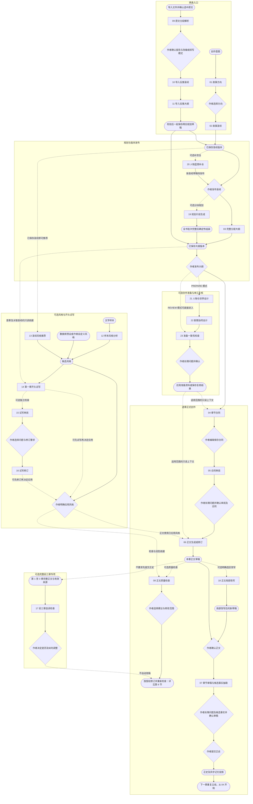
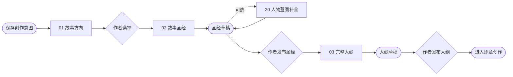
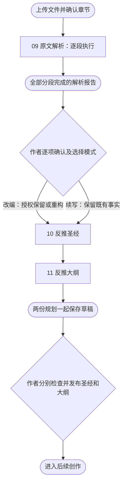
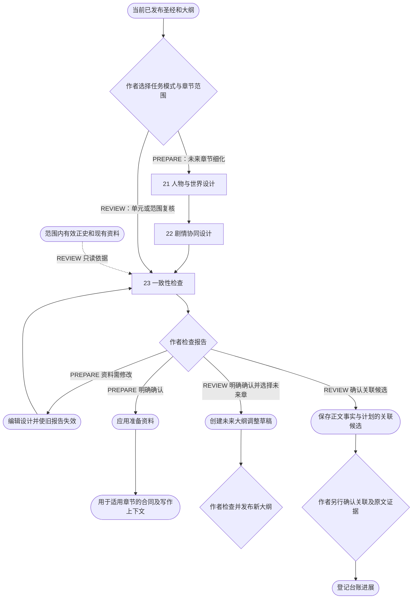
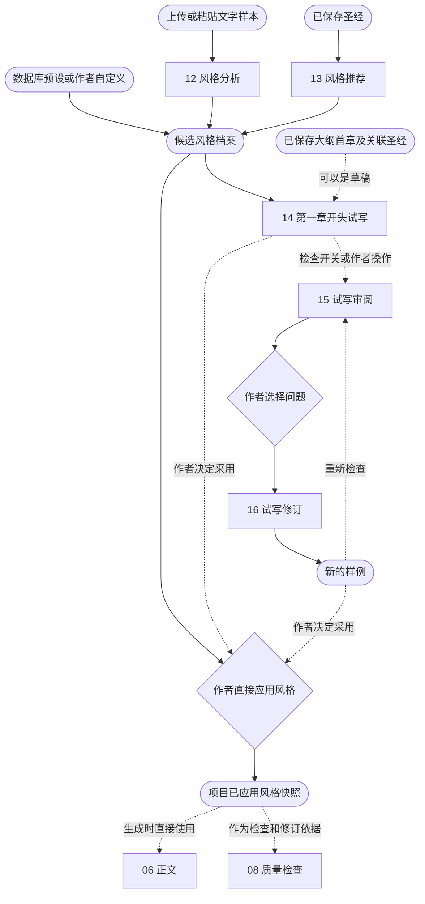
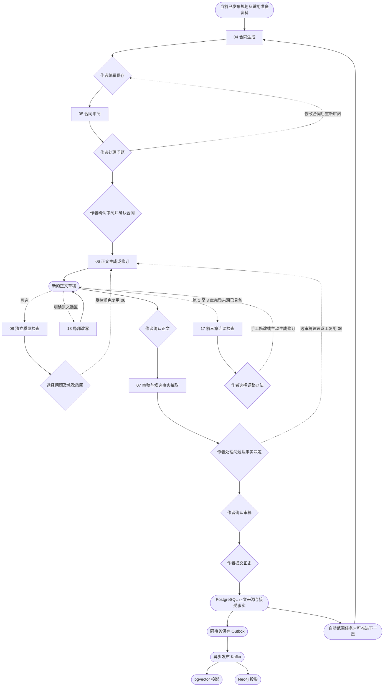
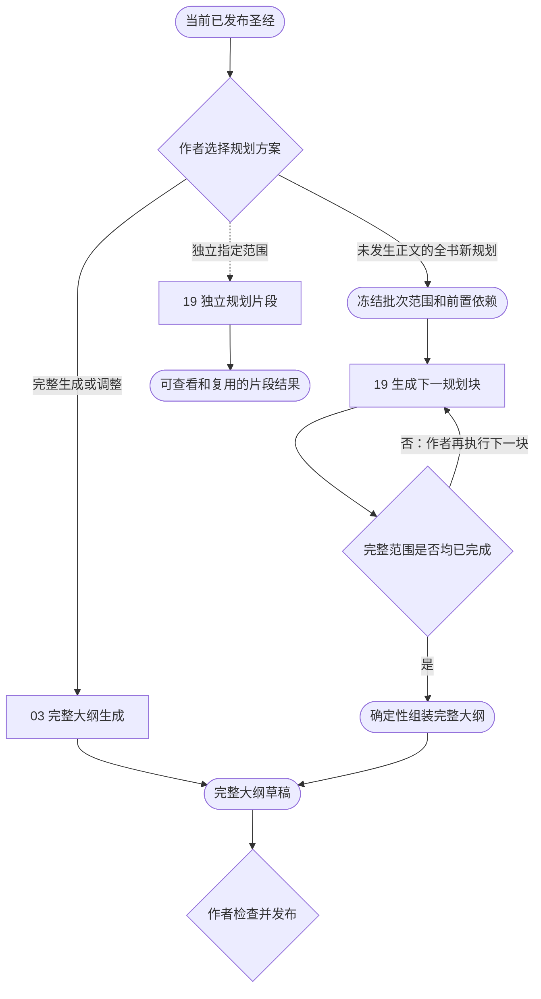

# Novel Agent：23 个模型工作流拓扑

> 本文保留为 2026-10-06 历史拓扑。合同与合同审阅已移除，人物相关设计合并为统一 Agent；当前 20 个工作流见 [简化流程](NOVEL_AGENT_SIMPLIFIED_WORKFLOW.md)。历史图不再代表当前调用顺序。

核对日期：2026-10-06。依据当前服务端实现整理，不是未来产品蓝图。

## 1. 怎么读这张图

系统有 **23 种模型工作流**，但不是每部小说、每章都要依次调用 23 次。它们组成两条入口、若干可选支路，以及循环执行的逐章主线。

- 编号 `01`～`23` 对应模型工作流类型，不表示执行序号；同一种可以因分段、逐章或修订多次调用。
- 矩形编号节点是模型工作流；菱形是作者选择、发布或确认；圆角节点是资料或确定性业务操作。
- 实线表示执行先后或前置关系，**不表示点击上一步后系统必然自动执行下一步**。
- 虚线表示可选调用、只读资料依赖或作者决定后的反馈，边上的文字说明其含义。
- 所有模型结果都先经过服务端解析与业务校验；图中为减少噪声没有逐个展开校验节点。
- 本文使用 Mermaid。支持 Mermaid 的 Markdown 预览可显示图形；后面的文字路径和清单可独立阅读。

最重要的区分：**生成成功 ≠ 作者确认 ≠ 发布规划 ≠ 提交正史。**

## 2. 全部 23 个工作流总览

总图只展开前向依赖，保持“入口 → 规划 → 可选准备与风格 → 正文 → 审稿与正史”的阅读顺序。修订、重新检查、单元复核和下一章循环在分图中展开，避免总图被长距离回线淹没；整个系统并非只有一个固定拓扑排序。

总图包含 23 个模型节点和作者门禁，适合放大查看：[打开矢量总图](diagrams/novel-agent-23-topology.svg)。若当前预览不渲染 Mermaid，可直接查看矢量图；日常阅读建议按第 3～7 节逐段查看。

总览中有几个不能省略的限制：

1. 导入反推不是先发布圣经再调用反推大纲。`10 → 11` 在同次规划请求中串行执行，大纲读取刚生成的圣经；两者通过后才一起保存草稿，再由作者分别检查和发布。
2. 分块规划中的确定性全书组装仅属于完整批次流程。独立片段不会自动成为一份完整大纲，也不会自动发布。
3. `23` 在 PREPARE 模式下检查前两步的设计；REVIEW 模式下直接检查当前范围，不重新执行 `21`、`22`。
4. 风格支路和准备支路不存在固定先后顺序，也没有“必须先准备才能试写”的门禁。适用、已确认准备会进入相关写作上下文。
5. `17` 的来源必须包括完整前三章及有效合同、大纲、圣经，预算也要允许完整检查；正文草稿可作为来源，不要求先提交正史。
6. 总图不展开回线：质量润色与审稿返工复用 `06`；试写修订可回到 `15` 复检；正史形成后可主动以 REVIEW 模式运行 `23`。这些操作不是新增 Agent，详见分图。

## 3. 两条入口怎么汇合

### 3.1 从想法开始

文字路径：**创作意图 → 方向 → 作者选择 → 圣经 → 作者发布 → 大纲 → 作者发布 → 合同。**

人物蓝图已经在圣经生成的同一次模型输出中设计。`20` 是可选补全，只补空白或缺失人物，创建新的圣经草稿；不覆盖原版本或直接写人物正史。作者发布后，规划资料同步才会建立人物身份、补档案空白、保存规划关系和明确台账。

### 3.2 从已有文字开始

文字路径：**文件与章节确认 → 分段解析 → 作者确认报告与模式 → 反推圣经 → 反推大纲 → 两份草稿保存 → 作者发布。**

- 原文确认、解析报告确认、生成规划、发布规划是不同动作。报告确认本身不保证已经发起反推请求，应以生成状态及任务记录为准。
- 素材改编允许按作者逐项授权重新设计，从第一章重新创作；续写大纲将导入范围标记为 `OCCURRED`，未来章节标记为 `PLANNED`。
- 导入规划无需先执行 `01`、`02`、`03`；后续作者要重新规划或修订时，才可主动使用标准规划入口。
- `OCCURRED` 是大纲的已发生标记，**不等于原文已被提交 PostgreSQL 正史**。报告和规划不会自动物化正文事实。

## 4. 大纲后的创作准备

PREPARE 的三步是：

| 阶段 | 设计或检查内容 | 结果边界 |
| --- | --- | --- |
| 21 人物与世界设计 | 人物档案、实体、开篇状态、能力与限制 | 规划设计，不是正文事实 |
| 22 剧情协同设计 | 剧情单元、关系、知识边界、时间线、明确伏笔与承诺计划 | 未来协同计划，不提前兑现 |
| 23 一致性检查 | 对来源与设计查冲突、证据和覆盖 | 报告，不能代替作者应用 |

范围按章节与剧情单元选择，不固定 15 万字。短篇可以选择全篇尚未发生范围；长篇可以分范围准备，形成正文正史后再主动复核。

REVIEW 可以不选择大纲调整，仅保存复核结果；如果选择调整，也只能创建未来章草稿。任何模式都不能靠“检查完成”自动改写已发生章节、发布新大纲或把计划当正史。

## 5. 风格不是逐章末尾才追加的一步

三种风格来源是替代选择，不是必须依次执行：**选预设、分析样本、圣经推荐**。推荐和分析得到的都是候选，只有“应用风格”才保存项目配置。

试写是可选评估环，不需要章节合同，也不要求先应用风格。`14` 返回第一章开头样例，不是正式完整章节；`15`、`16` 操作样例，不创建正式正文版本或提交正史。每份试写报告仅允许一次修订尝试，再改需重新检查。

正式正文在 `06` **生成时就使用已应用风格**；后续质量检查可以再发现风格偏差，作者选建议后仍复用 `06` 修订。不存在必经的“先写无风格正文，再套风格”模型阶段。

## 6. 逐章写作、润色和正史门禁

### 6.1 质量检查与正史审稿的区别

| 对比 | 08 质量检查 | 07 章节审稿 |
| --- | --- | --- |
| 主要目标 | 风格、通顺、逻辑、场景表达 | 连续性、一致性及候选事实抽取 |
| 正文前提 | 已保存正文即可，不要求先接受 | 必须是作者确认的正文 |
| 是否写候选事实 | 不承担正史事实抽取 | 生成候选，作者逐项决定 |
| 是否直接改正文 | 不改，只返回报告 | 不改，返工由作者选择 |
| 如何修订 | 选择建议后复用 06，生成新草稿 | 选择审稿建议后复用 06，生成返工草稿 |
| 是否可直接推进正史 | 不可 | 作者确认审稿后，仍需另行提交正史 |

表达润色默认只允许表达层；场景结构修改需要作者显式授权，仍不能补造事实、改变事件结果或越过视角知识边界。局部改写 `18` 只替换准确选区，选区外内容由确定性拼接保留。

每次新稿都要重新确认；需要继续检查时应读取新稿的有效报告，不能用旧正文的报告批准新稿。正史已提交的章节产生新稿后，必须走受控正史替换，不会自动覆盖旧正史；后续章存在有效正史时不能直接替换前章。

### 6.2 自动创作任务到底会自动执行什么

自动任务串行调用 `04 → 05 → 06 → 可选 08 → 07`，但在作者门禁处等待，**不会自动确认合同、接受正文、确认审稿或提交正史**。

自动语句润色默认关闭。开启后，只有有效报告的所有问题都属于 `INFO + FLUENCY` 才允许有限轮次地 `08 → 06 → 08`；风格、逻辑、场景或更严重问题交作者处理。达到轮数或生成额度上限即等待，不无限循环。

## 7. 完整大纲与分块规划是两条方案

`19` 可运行多次，但仍只算一种工作流。全书批次每次显式推进一块，并承接前置块，不并行猜写后续块；完整组装不再调用 `03`，也不新增“组装 Agent”。独立片段复用受版本和依赖指纹约束，不能仅凭同名标题或相同范围就采用。

## 8. 23 种工作流索引

| 编号 | 工作流标识 | 中文职责 | 主要输入 | 输出及下一站 |
| --- | --- | --- | --- | --- |
| 01 | STORY_DIRECTION | 生成故事方向 | 创作意图、作者要求、可选旧方向 | 方向候选，作者选择后进入 02 |
| 02 | STORY_BIBLE | 生成故事圣经 | 所选方向、创作意图、可选基准圣经 | 圣经草稿，作者发布后进入规划 |
| 03 | OUTLINE | 完整分层大纲 | 已发布圣经、字数预算、独立项目策略、作者要求、可选基准大纲 | 完整大纲草稿，作者发布 |
| 04 | CHAPTER_CONTRACT | 章节合同 | 当前已发布规划、目标章、记忆、适用准备 | 合同草稿，进入 05 |
| 05 | CHAPTER_CONTRACT_REVIEW | 合同审阅 | 源合同及行版本、有效规划、记忆 | 审阅报告，作者处理并确认合同 |
| 06 | MANUSCRIPT | 正文生成或修订 | 已确认合同、风格、记忆、人物资料、授权修改范围 | 新正文草稿，检查或作者确认 |
| 07 | CHAPTER_REVIEW | 审稿与事实抽取 | 作者已确认正文、合同、实体目录、正史记忆 | 审稿及候选事实，作者决定与确认 |
| 08 | QUALITY_REVIEW | 正文质量检查 | 已保存正文、有效来源、风格与资料 | 四维报告，选建议后可复用 06 |
| 09 | IMPORT_SOURCE_ANALYSIS | 原文解析 | 导入所选原文的当前分段 | 有证据的分段报告，全部完成后作者确认 |
| 10 | IMPORT_REVERSE_BIBLE | 导入反推圣经 | 已确认报告、选中原文、导入模式、作者要求 | 本次圣经结果，供 11 使用 |
| 11 | IMPORT_REVERSE_OUTLINE | 导入反推大纲 | 同一原文与报告、本次圣经、篇幅与策略 | 与 10 一起保存的规划草稿 |
| 12 | STYLE_ANALYSIS | 样本风格分析 | 作者提供的样本文字 | 风格技法候选，不移植样本故事 |
| 13 | STYLE_RECOMMENDATION | 圣经风格推荐 | 已保存圣经、数据库预设目录、作者偏好 | 推荐及理由，不自动应用 |
| 14 | STYLE_PREVIEW | 开头风格试写 | 已保存大纲第一章、关联圣经、候选风格 | 开头样例，不是正式正文 |
| 15 | STYLE_PREVIEW_REVIEW | 试写审阅 | 样例、候选风格、来源快照 | 带原文证据的检查报告 |
| 16 | STYLE_PREVIEW_REVISION | 试写修订 | 15 的报告、作者所选建议与要求 | 新样例，可重新执行 15 |
| 17 | FIRST_THREE_CHAPTERS_REVIEW | 完整前三章检查 | 三章完整正文、有效合同与规划、风格、预算 | 连读报告，作者决定修改 |
| 18 | MANUSCRIPT_LOCAL_EDIT | 正文局部改写 | 正文版本、准确选区、来源指纹及授权 | 选区替换候选，拼接保存新草稿 |
| 19 | PLANNING_CHECKPOINT | 规划片段生成 | 已发布圣经、范围、策略、前置计划及指纹 | arcs 片段，完整批次可确定性组装 |
| 20 | CHARACTER_BLUEPRINT_COMPLETION | 人物蓝图补全 | 指定已保存圣经版本、人物资料、作者要求 | 仅补空白的新圣经草稿，仍需发布 |
| 21 | CREATION_PREPARATION_WORLD | 人物与世界设计 | 已发布规划、准备范围和资料快照 | 人物、实体、初始状态设计，进入 22 |
| 22 | CREATION_PREPARATION_PLOT | 剧情协同设计 | 同一来源快照、21 的设计 | 单元、关系、知识、时间线与明确台账设计 |
| 23 | CREATION_PREPARATION_REVIEW | 准备或单元复核 | PREPARE 的设计，或 REVIEW 范围现有资料 | 一致性报告，作者确认后应用或选择未来调整 |

合计：**标准创作 8 + 导入 3 + 风格与试写 5 + 专项 4 + 创作准备 3 = 23。**

## 9. 不属于额外 Agent 的系统节点

| 节点 | 为什么不计为模型 Agent |
| --- | --- |
| 人物命名、独立档案填空、规划关系和明确台账同步 | 按已确认来源确定性同步，不另调模型 |
| 规划发布、合同确认、正文接受、审稿确认 | 作者操作与领域校验，不是模型推理 |
| 正史提交及受控替换 | PostgreSQL 事务与事实物化，不由模型直接执行 |
| Outbox、Kafka、pgvector、Neo4j 投影 | 异步基础设施；投影失败不等于正史提交失败 |
| 记忆查询、来源指纹、预算和输出校验 | 受控工具或程序逻辑；Embedding 不另算小说创作 Agent |
| 自动创作调度、批次认领、恢复和取消 | 编排已有工作流，不增加新的模型角色 |
| 全书规则巡检与台账浏览 | 读取现有摘要、计划和来源，不是模型逐字通读全书 |

`AgentStage` 枚举目前只有六项，它是原始阶段和记忆预算的分组，不是全部模型工作流注册表。本文以真实出站调用的工作流标识统计。

## 10. 与代码的对应关系

以下代码位置用于核对图中“哪些顺序由程序执行，哪些需要作者操作”。路径相对于项目根目录。

| 拓扑部分 | 主要实现 |
| --- | --- |
| 方向、圣经、完整大纲 | `apps/server/src/main/java/com/novelagent/planning/application/StoryDirectionService.java`、`StoryBibleService.java`、`OutlineService.java` 与各自 GenerationWorkflow |
| 原文分段解析 | `apps/server/src/main/java/com/novelagent/ingest/application/ImportAnalysisRunner.java`、`ImportAnalysisStore.java` |
| 导入两次串行反推与草稿保存 | `apps/server/src/main/java/com/novelagent/ingest/application/ImportedPlanningService.java`、`ImportedPlanningDraftStore.java` |
| 准备三步与 REVIEW 单步 | `apps/server/src/main/java/com/novelagent/planning/application/CreationPreparationRunner.java`、`CreationPreparationStore.java`、`CreationPreparationApprovalService.java` |
| 人物蓝图补全 | `apps/server/src/main/java/com/novelagent/planning/application/CharacterBlueprintCompletionService.java`、`CharacterBlueprintDraftStore.java` |
| 独立片段与全书批次 | `apps/server/src/main/java/com/novelagent/planning/application/PlanningCheckpointRunner.java`、`PlanningCheckpointService.java`、`PlanningBatchRunner.java`、`PlanningBatchService.java` |
| 风格来源、试写与试写编辑 | `apps/server/src/main/java/com/novelagent/writing/application/WritingStyleAnalysisService.java`、`WritingStyleRecommendationService.java`、`WritingStylePreviewService.java`、`StylePreviewEditingService.java` |
| 模型阶段分派 | `apps/server/src/main/java/com/novelagent/writing/application/WritingGenerationWorkflow.java`、`apps/server/src/main/java/com/novelagent/writing/infrastructure/WritingGenerationGateway.java` |
| 合同、正文、质量、审稿与局部改写 | `apps/server/src/main/java/com/novelagent/writing/application/ChapterContractService.java`、`ManuscriptService.java`、`QualityReviewService.java`、`ChapterReviewService.java`、`ManuscriptLocalEditService.java` |
| 前三章完整来源与检查 | `apps/server/src/main/java/com/novelagent/writing/application/FirstThreeChaptersService.java`、`apps/server/src/main/java/com/novelagent/writing/infrastructure/FirstThreeChaptersPersistence.java` |
| 自动任务推进与等待 | `apps/server/src/main/java/com/novelagent/agent/application/AutomationService.java`、`ChapterAutomationPlanner.java` |
| 规划同步及正史提交 | `apps/server/src/main/java/com/novelagent/planning/application/PlanningMaterialSyncService.java`、`apps/server/src/main/java/com/novelagent/canon/application/CanonCommitService.java` |

详细提示词、输入、输出、预算及门禁见 [小说 Agent 阶段与 Prompt 设计](NOVEL_AGENT_STAGES_AND_PROMPTS.md)。本图不替代代码和权限、版本校验，也不保证模型能识别所有文学或逻辑问题。
