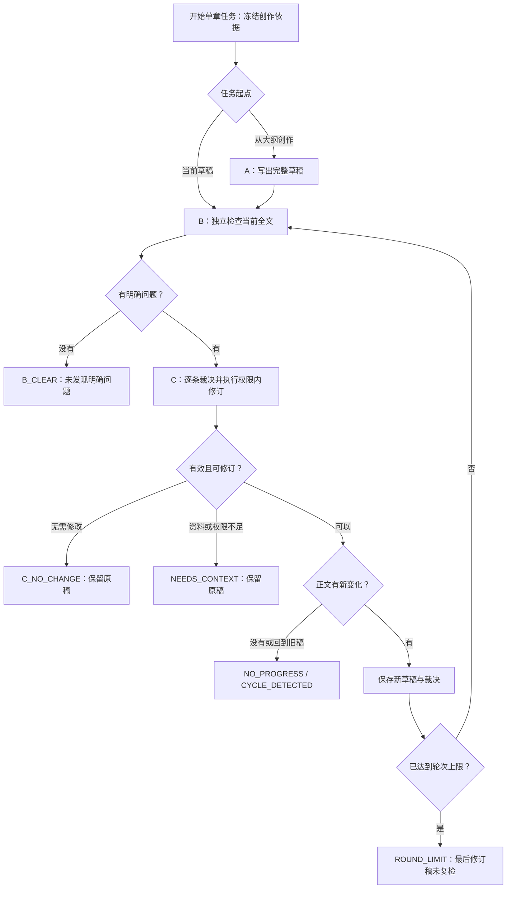

# 单章自动写作与检查

## 当前入口

正文工作台与质量检查页的“自动写作与检查”。有两种起点：从已发布大纲创作新草稿（A），或检查当前已保存且写作依据有效的草稿（直接 B）。共用用户全局模型与强度，真实模型必选，不额外要求作者填写本轮要求、勾选问题或逐轮确认。

## A、B、C 分工

| 角色 | 模型任务 | 输出及授权 |
| --- | --- | --- |
| A | MANUSCRIPT | 专业爽文作家，第一稿落实选定风格、章节与有效场景计划；完整标题、正文、摘要、连续性备注与修改说明 |
| B | QUALITY_REVIEW | 独立查 STYLE / FLUENCY / LOGIC / SCENE，最多20条，不设最低问题数；当前原文逐字证据、已有依据、缺口、候选设计、影响、建议；不改正文，不作数值评分 |
| C | DRAFT_JUDGE_REVISION | 逐项 ACCEPT / REJECT / DEFER 与原因；REVISED 返回完整稿及与稿一致的摘要、备注；NO_CHANGE / NEEDS_CONTEXT 不返回新稿 |

B 的意见不是事实。C 独立收到与 A、B 同源的圣经、人物档案、风格执行指南、本章大纲与场景、创作准备、相关正史/知识/关系、实际提供的前两章参考与未来边界。共用冻结输入，不由 B 的摘录替代这些依据。

C 可以补充计划内对白、动作与过渡，不能用“润色”变更人物既往经历、能力、关系、关键设定或核心事件结果。有效问题超出权限时暂缓；循环自动结束，不插入人工操作。此边界写入默认与自定义 C 提示词的保护规则。模型裁决不是客观正确性的证明；服务端只检查输出协议、当前原文证据和编号覆盖，不添加文学结构判分。

现有手动质量检查仍使用原质量报告结构和界面；自动 B 无评分报告存在任务轮次中，两者不冒充彼此的结果。单独切换自动模式不会重跑或修改已完成的手动报告。

## 状态、版本和费用

- 上限1至10轮，默认10。每轮最多 B、C 各一次；A最多一次，因此从大纲开始至多21次模型调用，不是必然调用21次。达到终止条件立刻结束；失败不自动重试。
- B_CLEAR 只表示本轮 B 未发现明确问题，不保证全文绝对正确。C_NO_CHANGE 不等于 B 通过。十轮后的最终 C 修订稿明确标为“未复检”，不再追加第十一轮 B。
- 每轮保留原稿、检查报告、逐项裁决与修订稿关联。前端可查历史、修改说明及由真实前后正文计算的差异。正文为独立 DRAFT 版本，不覆盖原稿、不自动作者确认、不写正史或记忆投影。
- 保存前锁内核对发布规划、人物、风格、策略、正史水位、前文与当前草稿行版本；来源变化停止并舍弃迟到结果。导入 OCCURRED 章节拒绝自动改写。
- 停止按钮先持久化取消，再使用既有供应商中断机制；阶段间的取消也会阻止下一次调用，已取消任务的迟到结果不能保存。不能保证供应商立刻停止计费。
- 新任务与运行中的范围章节推进任务互斥；原范围任务保留原来的正文/正史人工确认门禁，不冒充 ABC 闭环。
- 浏览器刷新不丢任务。当前后端实例重启时，自己的未完成任务标为 INTERRUPTED，不自动重试；已有结果保留。默认实例身份为主机名、服务端口与 app.role；多实例部署应给每个逻辑实例设置独立且稳定的 app.instance-id。
- A/B/C 均通过公共网关，Codex 使用 NEW_THREAD，不依赖其他角色的隐式会话历史。DeepSeek 无状态。全局模型与模板每次请求按现有网关冻结并记录实际版本，不自动降低强度。保存过的自定义 A/B 提示词不会被新默认文本覆盖，可在提示词设置中恢复默认或合并新规则。

## 数据与接口

V052 新增 draft_loop_run：请求幂等键、项目/章节/供应商、起点、轮次上限、执行阶段/终止原因、冻结来源、当前草稿与行版本、全部轮次、正文指纹、错误、实例身份与时间。权威正文继续保存在 manuscript_version。

| 接口 | 行为 |
| --- | --- |
| POST /api/v1/projects/{projectId}/chapters/{chapter}/draft-loops | Idempotency-Key 必填；provider、writeFirst、maxRounds；202 返回进度，后台串行执行 |
| GET 同路径 | 当前章最近20项任务及轮次；核验项目归属，不返回冻结资料快照 |
| POST 同路径/{id}/actions/stop | 核验项目与章节，取消任务并尝试中断当前模型 |

新 C 在全局“提示词”设置可编辑。当前目录为22种活动模型工作流、24份模板；只是新加裁决与修订，不恢复合同或合同审阅。模型任务页可查看 A/B/C 实际 Prompt、响应、错误与用量。请求日志隐藏原文、候选补丁、裁决理由与修改说明，保留项目、阶段、状态与耗时。

## 验证与部署

单元覆盖逐条裁决、原文证据、无问题/无需改/资料不足/无进展/震荡/十轮上限/取消/失败/来源保护及串行调用；隔离 PostgreSQL 测试使用真实迁移、Spring、API、网关记录与持久化，模型及来源检索使用替身。浏览器交互覆盖刷新、停止、裁决与差异，以及320/390/1440宽度布局。

需要重启后端加载 V052 与新接口。验证不调用真实付费模型，不修改现有项目；没有验证实际作品阅读吸引力或承诺无遗漏。前端地址仍为 http://localhost:5173/。
