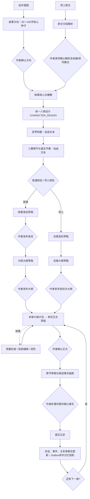
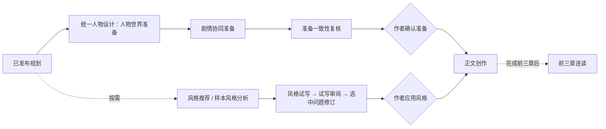

# Novel Agent 简化创作流程

更新日期：2026-10-07。以 `codex/simplify-agent-workflow` 当前代码为准。

## 1. 本次变化

- 移除章节合同、合同审阅的前端入口、生成调用和作者批准门禁。
- 正文直接读取已发布圣经与当前大纲中的章节计划，不创建隐形合同记录。
- 新正文保存 `writing_basis`：来源大纲 ID、写作上下文指纹、本章计划快照。生成期间主要依据变化则拒绝保存结果。
- 人物初始设计、圣经人物补全、创作准备中的人物世界设计统一调用 `CHARACTER_DESIGN`，不是三个独立人物 Agent。
- 原文解析与作者确认后，按“核心与梗概 → 人物设计 → 世界构建 → 三幕情节 → 反推圣经 → 反推大纲”串行执行；任一步失败停止。新故事生成圣经也复用四步自由文本底稿，有限修订不重跑。
- 作者确认正文、审稿事实决策和正史提交门禁保留。检查与润色不自动发布正文。

当前可编辑目录为 **21 种模型工作流、23 份提示词模板**。导入圣经、导入大纲各有改编与续写模板，因此模板数比工作流数多 2。这不表示每章需要调用 21 次。

## 2. 主流程

普通新建路径：先发布圣经，再生成并发布大纲。导入反推路径：一次请求先生成圣经草稿，再基于该草稿生成大纲草稿；不自动发布任何规划。

图中的箭头表示依赖，只有雪花底稿、导入反推、自动创作及创作准备内部的串行调用自动衔接，其他作者确认仍需要显式操作。

## 3. 统一人物设计

| 模式 | 输入及权限 | 输出去向 |
| --- | --- | --- |
| NEW_STORY | 已确认方向、创作意图、作者要求；设计主要角色 | 同次圣经草稿 |
| 圣经有限修订 | 原圣经整合 Agent 直接读取基准与作者本轮范围；不独立重跑人物/雪花四步 | 新圣经草稿 |
| ADAPT_SOURCE | 原文、已确认解析、KEEP/REWORK/DROP 授权 | 反推圣经与大纲复用同一人物蓝图 |
| CONTINUE_MANUSCRIPT | 原文事实与证据优先；未知、推测不得写成过去 | 反推圣经与大纲复用同一人物蓝图 |
| COMPLETE_MISSING | 指定圣经、已有蓝图；只补空白与缺失人物 | 待作者发布的圣经修订草稿 |
| 创作准备 | 当前圣经、大纲、独立人物档案及范围；作者已有非空档案优先 | 人物及非人物实体准备草稿 |

人物设计优先 3～6 个核心角色，不为凑人数造人；已有群像最多 12 人。每人包括身份职业、性别年龄、背景外貌、秘密弱点、表达习惯、能力限制、行为底线、物品来源与知识边界。

- `coreDesire` 分别组织表面追求、深层渴望、灵魂需求，并写清三者冲突。
- `characterArc` 组织初始状态 → 触发事件 → 认知失调 → 蜕变节点 → 最终状态，节点落实到选择与代价。
- `initialRelationships` 描述双方诉求、价值冲突、合作纽带、潜在信任破裂；未来背叛不是已发生事实。

新故事与导入的中间人物设计使用自由文本，不逐字段校验；整合圣经时映射到现有蓝图以供页面编辑。人物补全与创作准备仍复用现有资料输出接口。人物设计结果随模型任务记录；发布圣经后，现有规划同步服务填充独立人物档案空白与规划关系，不直接写正文正史。

## 4. 创作方法如何落地

| 方法 | 实现位置与边界 |
| --- | --- |
| 雪花渐进规划 | 核心与一段梗概 → 人物 → 世界 → 三幕情节 → 圣经 → 章节大纲；中间自由文本逐步扩展，不强制经典十步 |
| 人物弧光 | 统一人物设计中的驱动力三角、五阶段弧线、关系冲突；续写区分事实与未来设计 |
| 世界构建 | 圣经、反推圣经及人物世界准备：物理、社会、隐喻三维，必须影响决策；不把隐喻编成超自然规则 |
| 三幕结构 | 大纲和反推大纲：触发、对抗、解决；错误选择、虚假胜利、低谷、最终抉择、伏笔回收按故事因果安排 |
| 悬念节奏 | 大纲与准备剧情单元：通常 3～5 章一单元，短篇可更短；用现有节奏、事件、揭示等字段表达，不新设桥段配额 |
| 状态追踪 | 作者确认审稿事实并提交正史后物化状态与关系；正文和摘要通过原有 Outbox/投影进入长期记忆，异步成功状态仍以投影记录为准 |

这不是强制爽点模板。FANQIE_GRIPPING 控制前三章结构与期待，写作风格控制表达；STANDARD、短篇、安静章节仍保留题材与作者节奏。提示词改善不等于已经证明文学质量。

## 5. 按需支路

创作准备不是合同的改名，也不是必经门禁。其已确认规划仍供正文读取；它不能代替作者接受正文或提交正史。

## 6. 接口、部署与清理

- 原正文生成、编辑、确认、质量检查、审稿、正史提交接口继续使用。
- 合同及合同审阅写入接口返回 410，不能通过旧客户端恢复被移除的阶段；活动提示词目录不再提供这两个 Agent。
- 前端写作默认进入正文页，章节进度显示正文草稿、检查润色、作者确认、正史审稿、正史发布。
- 新增 Flyway `V050__outline_based_manuscripts.sql`，必须重启后端应用新代码和迁移；前端开发端口仍为 5173。
- 旧数据不作为本轮兼容验收目标；清理范围须区分旧合同记录与全部创作数据，避免未经范围确认删掉导入原文或正文。
- 没有新增依赖，没有调用真实付费模型来验证文学质量。数据库验收使用隔离 schema 和模型替身，不改已有项目。

新增 V051 雪花规划、接口与验收边界见 [雪花渐进规划实现](NOVEL_AGENT_SNOWFLAKE_PLANNING.md)。

## 7. 流程简化验证（V050）

- 服务端全量 596 项：546 通过、50 环境门禁跳过，无失败。
- 另外隔离 PostgreSQL / 完整 Spring 装配 49 项全部通过，包含 V050 迁移、无合同正文生成、自动创作、准备与导入、提示词 API。
- 前端 213 项单元测试、10 项浏览器交互测试全部通过，覆盖 320、390、768、1440、1920 像素视口；截图已检查。
- 前端类型检查、生产构建及本轮改动文件 ESLint 通过。
- 本轮代码与新增说明无 diff 空白错误；原有文档移动中的 Markdown 双空格换行保留，没有擅自格式化作者文档。

以上验证使用受控模型替身，不证明实际模型生成的吸引力、人物一致性或风格质量。现有运行后端尚未重启，隔离测试通过不代表已有项目已部署新版本。
