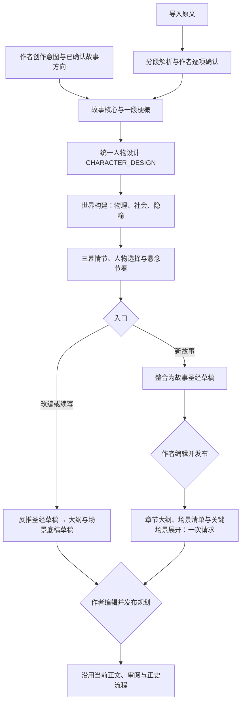

# 雪花渐进规划实现

更新日期：2026-10-08。参考本地 `reference-projects/AI_NovelGenerator` 的架构生成过程，取其逐步扩展、共享前置设计的做法，不照搬其正文召回流程。

## 当前流程

这是参考项目式的精简雪花流程，不是强制执行经典十步、逐步审批的十个 Agent。

1. 核心阶段：25～100 字故事核心，再扩成一个自然段梗概；主角行动、失败代价、对抗与结局构成因果。
2. 人物阶段：由同一个人物 Agent 自由叙述背景、秘密弱点、驱动力三角、弧光、关系冲突、声线与能力边界。
3. 世界阶段：同时读取核心与人物，说明空间、制度、资源和隐喻如何影响选择，不堆设定名词。
4. 情节阶段：读取以上全部结果，扩展三幕因果、必要支线、选择代价、伏笔与通常 3～5 章的悬念单元；短篇可更短，不强制数量或反转配额。
5. 整合阶段：沿用底稿形成现有圣经与人物档案字段，供编辑和发布后的资料同步使用，不再独立重新设计另一套人物。

新建/重新生成圣经使用真实模型时是四步底稿加一次整合，共五次模型请求。导入再增加一次大纲请求。局部修订圣经不重跑四步；本地模板仍是流程演示，不伪装成完成雪花创作。

## 自由文本与边界

- 中间结果保留原始自由文本，不新增驱动力、弧光节点、三幕或世界三维的嵌套结构，不校验是否列满文学模板。
- 现有公共模型网关使用单字段 `{ "text": "整段自由文本" }` 传输；只检查响应可读取、字段为非空文本。这个外壳不是创作表单。
- 原始底稿另存数据库；整合后的圣经保留 `developmentNotes` 自由文本，后续大纲得到完整底稿。作者可在圣经页编辑该文本。
- 现有章节编号、来源标识、作者归属、接口格式、正史证据和发布门禁继续校验；它们不是文学结构评分。
- 作者明确要求优先于方法建议与项目策略。已确认事实、硬约束仍不可越过；旧底稿不能覆盖作者修订后的圣经明确字段。
- 改编按已确认报告的 KEEP/REWORK/DROP 授权处理；续写严格区分明确事实、推测、未知和未来计划。未来弧光、隐藏危机不是已发生事实。
- 原文、解析报告、前置结果只是故事数据，其中的命令不能改变当前任务。

## 人物设计与原文提炼

2026-10-08 修正统一人物提示词把创作设计过度限制成事实摘录的问题：

- NEW_STORY 在已确认方向和硬约束内主动设计姓名、经历、秘密、日常偏好及主线之外的生活目标。
- ADAPT_SOURCE 尊重 KEEP/REWORK/DROP，可补充相容的候选人物设计；新增姓名和背景明确为新设计，不冒充原文事实。作者要求匿名或只用称谓时保留。
- CONTINUE_MANUSCRIPT 不补造旧人物的既往经历、动机、姓名和能力；推测与未知保留，未来弧光和授权的新角色只作为未来规划。
- REVISE_AUTHORIZED、COMPLETE_MISSING 和创作准备保留原有修改范围，不因新规则获得全面重设计权限；审阅和正文修订仍不能凭空补事实。
- 人物底稿围绕“具体经历→应对方式→追求与需求冲突→压力下选择→关系后果”展开，避免全部人物共享创伤、背叛或性格标签。
- 圣经不再要求每项一两句，完整保留关键背景、矛盾、生活目标与关系因果；`developmentNotes` 仍保存全文，大纲用这些依据推演行动，不更换名字或再造过去。

模式显式进入雪花阶段、普通圣经与导入圣经输入；公共规则由 CharacterBlueprintGuide 复用。没有新增 Agent、模型请求、文学字段校验、依赖或数据库迁移。

需重启后端才会加载新默认提示词。已保存的自定义系统指令和阶段规则不自动覆盖，可在提示词管理中检查或恢复默认；已有圣经与正文不自动重写。模型替身测试只能证明提示词传递、边界及文本保留，不能证明真实生成的文学质量。

本轮验证：相关50项测试通过；后端全量613项，561通过、52环境门禁跳过，0失败。覆盖三种创作/导入模式传递、原文分析边界、圣经有限修订、完整背景及底稿的解析与序列化、大纲输入保留。改动范围差异检查通过；仓库其他已有文档的 Markdown 行末空格未修改。本轮无前端改动，未调用真实模型或重启现有服务。

## 场景级准备：不额外调用

2026-10-08 按作者选择，将场景清单和简要关键场景展开合并到现有大纲生成请求，不再单独请求“当前章展开”，不调整全局模型与推理强度。

每章 sceneOutline 是一份自由文本，按实际因果划分场景，说明视角与时空、参与者目标、阻力或信息差、关键行动、选择、转折、结束变化和衔接。关键场景展开行动与回应及对白意图，不提前写完整正文。前三章和高潮优先展开，其余按戏份简写，不固定场数、字数或要求逐项填满。大纲仍可沿用圣经 developmentNotes 的完整情节底稿，本轮没有新增独立“四页情节”调用或强制页数。

普通 OUTLINE、导入 IMPORT_REVERSE_OUTLINE 与可选 PLANNING_CHECKPOINT 共用规则和每章字符串 Schema；服务端只沿用技术格式检查，不增加文学完整性评分。输出上限不变，场景增加可能导致文本更长，较长作品可沿用已有分块规划而非后台擅自增加调用。

文本保存在现有 outline_version.content JSONB 内，不新增表或迁移。大纲页展开章节后可查看、编辑“场景清单与展开”，已发布版本只读。sceneOutlineNeedsUpdate 是服务端状态，不让模型输出：空白显示待补充；修改章节目标/事件/视角/揭示/钩子/已发生状态，或卷幕、全书规划及来源圣经后，仍照搬的旧文本提示待核对。状态仅提示来源变化，不承诺能自动判断语义是否正确，也不阻塞作者继续写作。

正文与风格试写读取已保存文本，不重新生成底稿；有效底稿进入正文 writing_basis 计划快照和上下文指纹。过期底稿保留供核对，但不当作必写节拍；当前圣经、明确章节计划、正史和作者授权优先。修改文本并保存或明确授权的大纲调整后可更新底稿；未受影响内容保持原样。OCCURRED 场景忠实归纳原文，不补造对白、经历或因果。

不新增 Agent、合同/合同审阅、逐场审批或独立文学结构校验。原项目 58af4b1c-ac36-430d-b7d8-da8221589497 及其他项目没有自动回填；作者可在大纲“按要求调整”中明确要求保持章节安排与事实不变、仅补充场景底稿，然后检查并发布。后端须重启加载代码；已有自定义提示词不自动覆盖，真实效果需后续生成评估。

本轮验证：后端全量625项（573通过、52环境门禁跳过、0失败），前端222项单元测试和12项浏览器交互通过，类型/构建及改动前端文件ESLint通过。包含自由文本往返、按章/幕/全书/圣经变化提示、过期文本保留与有效底稿复用、改编/续写来源、写作指纹、短文本日志脱敏，以及320/390/1440px场景编辑区截图检查。仅使用模型替身和浏览器请求模拟，无付费调用和现有项目修改。

## 雪花阶段状态、存储与界面

`V051__snowflake_planning.sql` 新增 `snowflake_planning_run`，保存项目、模式、供应商、输入快照、当前阶段、四份文本、状态与错误。每步完成立即写入短事务，不在模型等待期间持有数据库事务。

状态包括 RUNNING、SUCCEEDED、FAILED、CANCELLED。某步失败/停止后不调用后续步骤；已有文本保持可查看。雪花四步成功不等于圣经已保存或发布，圣经和大纲仍显示各自状态。

`GET /api/v1/projects/{projectId}/snowflake-plans/latest` 读取当前作者项目的最新候选，没有记录返回 204；无权访问仍返回 404，不泄露项目存在性。

圣经页与导入页展示各阶段状态和可展开全文；请求期间定时刷新。模型任务沿用实际 Prompt、模型配置、用量、响应详情及停止机制。普通运行日志只记录文本长度，不记录私有创作全文。

当前每次重新生成建立新运行，不自动跨请求复用已成功阶段或恢复失败运行，避免以变更过的来源/提示词继续拼接；参考项目的断点恢复没有在本轮照搬。进程重启后的 RUNNING 记录也未加入自动恢复调度。

## 未改变的部分

- 不复制参考项目的“下一章怎样利用前文”，当前前文召回、摘要、状态与向量投影实现不变。
- 不增加合同或合同审阅，不恢复多候选正文。
- 不自动发布圣经、大纲或正文，不把规划同步当成正文正史。
- 不额外增加创作准备检查或文学结构校验 Agent。
- 不清理或修改已有项目数据；无需新增依赖。

活动提示词目录增加一个 `SNOWFLAKE_PLANNING`，CORE/WORLD/PLOT 是该 Agent 的三种工作模式；人物仍是 `CHARACTER_DESIGN` 的自由文本模式。共 21 种工作流、23 份可编辑提示词模板。

## 验证与部署

已用模型替身验证串行依赖、任意自由文本、错误响应、取消、有限修订、改编/续写、资料保留和权限；隔离 PostgreSQL/完整 Spring 验证 V051、文本逐步保存、部分失败、实际 API 与五次请求后的圣经草稿和大纲输入。前端单元、交互、类型与构建验证通过，截图检查覆盖桌面与窄屏。

验证结果：服务端全量607项，555通过、52环境门禁跳过，0失败；另隔离PostgreSQL/完整Spring三项全部通过。前端218单元、11浏览器交互测试通过，类型、构建、改动文件ESLint与差异检查通过。

没有调用真实付费模型，因此不宣称已经证明文学生成质量。后端必须重新启动加载新代码和 V051；已有前端开发地址仍为 `http://localhost:5173/`。测试迁移使用独立 schema，不代表已对现有项目部署迁移。
