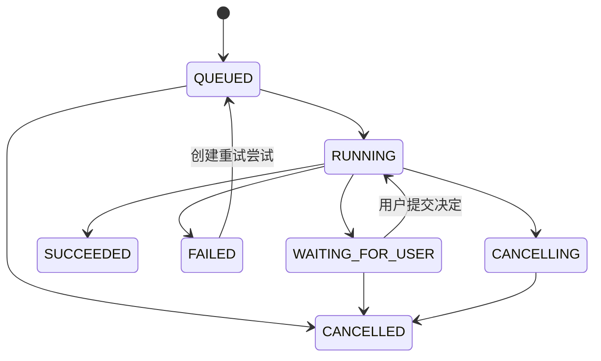
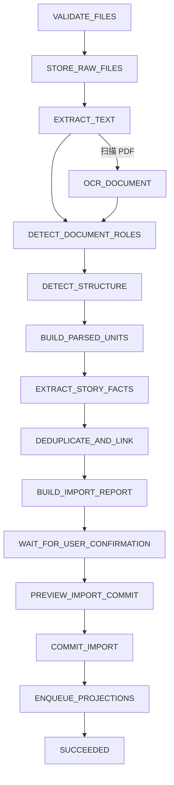
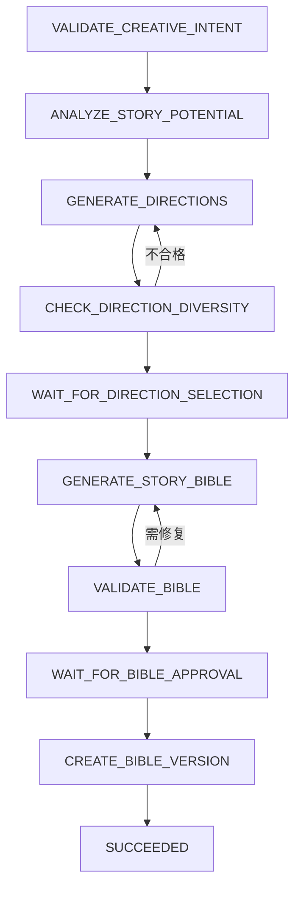
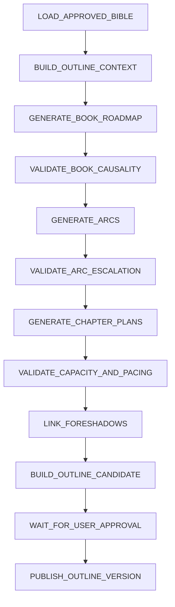
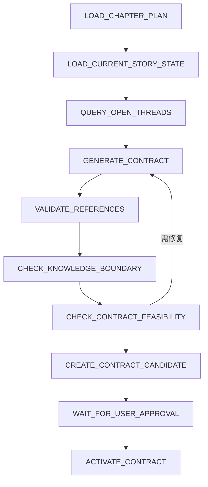
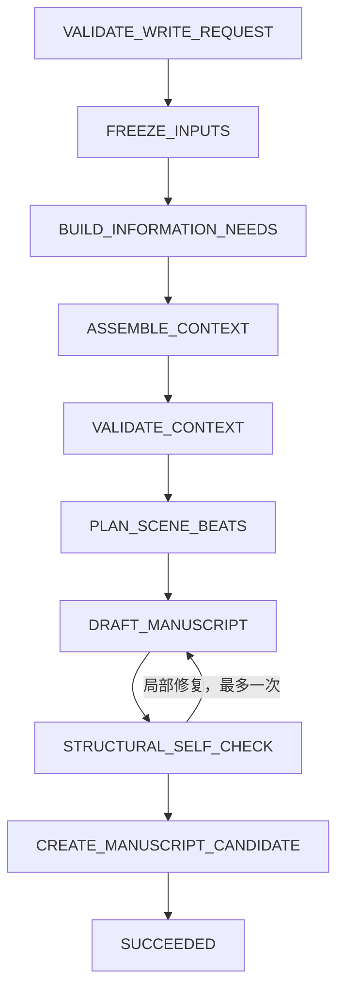
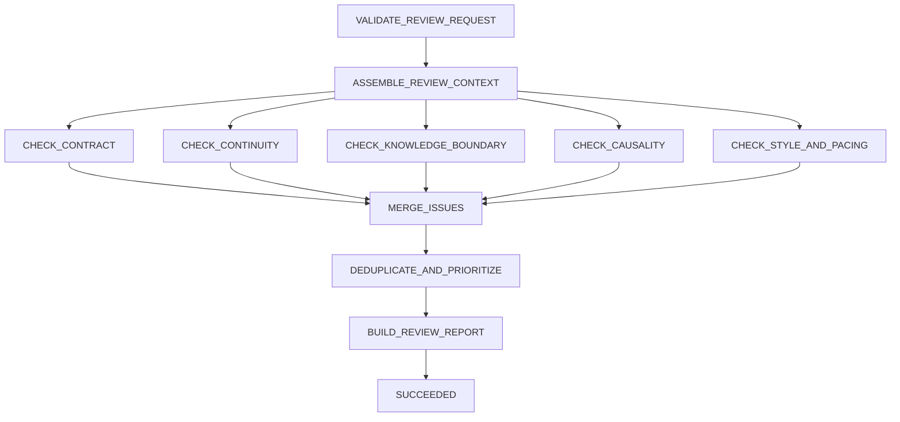
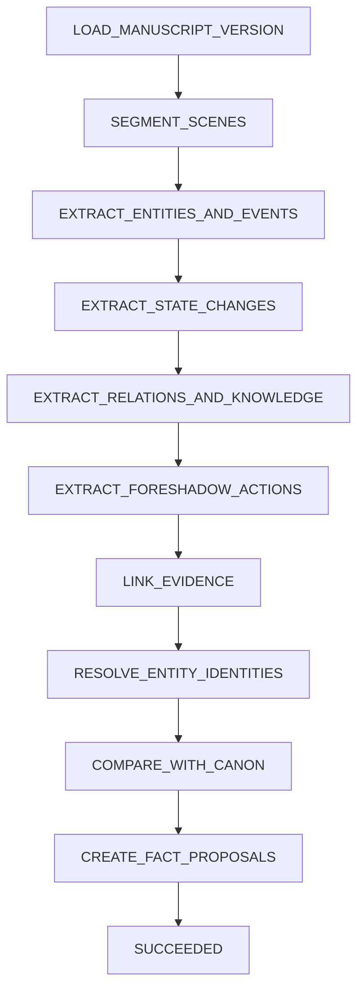
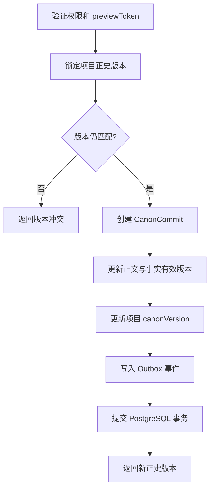
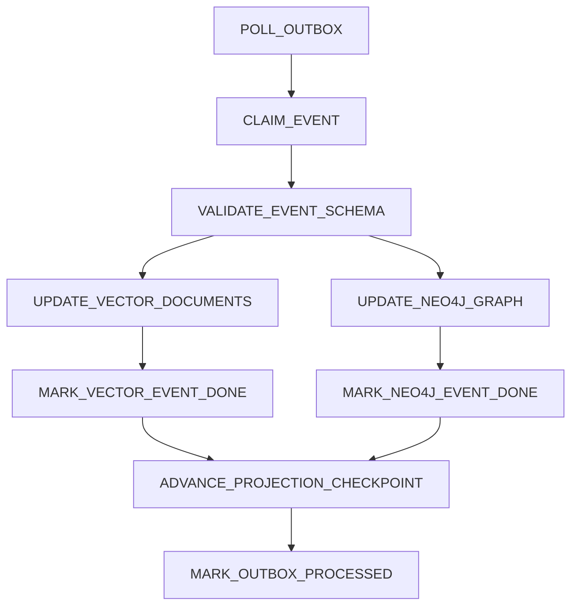

# 小说 Agent 工作流设计

> 文档状态：初稿  
> 目标版本：MVP 0.1  
> API 设计：[NOVEL_AGENT_API_DESIGN.md](NOVEL_AGENT_API_DESIGN.md)  
> 领域模型：[NOVEL_AGENT_DOMAIN_MODEL.md](NOVEL_AGENT_DOMAIN_MODEL.md)

## 1. 设计目标

本文定义小说 Agent 中长任务的执行方式，解决以下问题：

1. 导入、规划、写作和审稿分别经过哪些步骤。
2. 哪些步骤由代码执行，哪些步骤调用模型，哪些步骤等待作者。
3. 失败后从哪里重试，如何避免重复生成和重复写入。
4. 用户取消任务时如何安全停止。
5. 如何冻结上下文，保证生成结果可解释、可复现。
6. 正史提交后如何可靠更新 pgvector 和 Neo4j。

工作流负责组织过程，不负责决定正史。只有 `CanonCommitService` 可以在用户确认后推进正史版本。

## 2. 总体原则

### 2.1 确定性编排优先

工作流步骤和状态转移由代码定义，模型只在受控步骤内完成语义任务：

```text
代码负责
├── 步骤顺序
├── 状态迁移
├── 权限与版本校验
├── 重试、超时和取消
├── JSON Schema 校验
├── 事务和幂等
└── 人工审批边界

模型负责
├── 文本分类与抽取
├── 故事方案和大纲候选
├── 正文生成与改写
├── 语义审稿
└── 修订建议
```

模型不能自由创建新的工作流步骤，也不能直接调用正史提交、删除项目或发布内容等高风险工具。

### 2.2 输入冻结

每个 `AgentRun` 创建时冻结：

- `projectId`。
- `inputCanonVersion`。
- 大纲版本，可选。
- 章节合同版本，可选。
- 基础正文版本，可选。
- Prompt 版本和模型配置版本。
- 用户请求参数。

运行期间项目正史如果发生变化，当前运行可以完成草稿，但产物标记为 `STALE_INPUT`，应用或提交前必须重新校验。

### 2.3 产物不直接生效

所有模型输出先成为以下产物之一：

```text
OUTLINE_CANDIDATE
CONTRACT_CANDIDATE
MANUSCRIPT_CANDIDATE
FACT_PROPOSAL_SET
REVIEW_REPORT
REVISION_CANDIDATE
CONTEXT_SNAPSHOT
```

产物只能通过显式命令应用到草稿或进入候选区，不能直接修改当前正史。

### 2.4 至少一次执行与业务幂等

任务调度采用“至少一次执行”语义，每一步必须通过幂等键抵抗重复执行：

```text
stepExecutionKey = runId + stepKey + attemptInputHash
```

已成功步骤再次收到相同输入时直接返回保存的输出引用。输入变化必须创建新的步骤尝试或新的运行，不能覆盖旧结果。

## 3. 工作流运行时

### 3.1 MVP 实现

MVP 使用 PostgreSQL 持久化状态机和后台 Worker：

```text
API 服务
├── 创建 AgentRun 与初始 WorkflowStep
├── 返回 runId
└── 提供查询、取消、重试和 SSE

Worker
├── 领取可执行步骤
├── 执行代码、模型或工具调用
├── 保存输出与检查点
├── 推进后续步骤
└── 发布 SSE 事件
```

任务领取使用数据库行锁或租约：

```sql
select id
from workflow_step
where status = 'READY'
  and available_at <= now()
order by priority desc, created_at
for update skip locked
limit 1;
```

### 3.2 升级条件

满足以下情况后评估 Temporal：

- 单个工作流运行数小时或数天。
- 跨服务步骤和补偿逻辑明显增加。
- 大量任务等待人工审批。
- PostgreSQL Worker 的租约、定时器和恢复逻辑成为主要维护成本。

升级不改变领域状态和 API，只替换编排运行时。

### 3.3 运行状态



`FAILED` 不自动回到 `RUNNING`。重试命令需要创建新的尝试记录并确认失败步骤允许重试。

### 3.4 步骤状态

```text
PENDING       等待前置步骤
READY         可以被 Worker 领取
RUNNING       正在执行
WAITING       等待用户或外部条件
SUCCEEDED     已完成并保存输出
FAILED        已失败
SKIPPED       因分支条件跳过
CANCELLING    正在协作取消
CANCELLED     已取消
```

## 4. 步骤契约

### 4.1 WorkflowStepDefinition

每个步骤定义包含：

| 属性 | 说明 |
| --- | --- |
| `stepKey` | 工作流内稳定名称 |
| `executorType` | `CODE`、`MODEL`、`TOOL`、`HUMAN_GATE` |
| `inputSchema` | 输入 Schema 版本 |
| `outputSchema` | 输出 Schema 版本 |
| `timeout` | 单次尝试超时 |
| `maxAttempts` | 最大尝试次数 |
| `retryPolicy` | 可重试错误和退避策略 |
| `cancellable` | 是否支持执行中取消 |
| `checkpointPolicy` | 输出何时持久化 |
| `next` | 成功、失败和条件分支 |

### 4.2 StepExecutionContext

```json
{
  "runId": "0199...",
  "stepId": "0199...",
  "stepKey": "DRAFT_MANUSCRIPT",
  "attempt": 1,
  "projectId": "0199...",
  "inputCanonVersion": 18,
  "cancellationRequested": false,
  "deadline": "2026-09-25T13:24:00Z",
  "inputRefs": {
    "contractId": "0199...",
    "contextSnapshotId": "0199..."
  }
}
```

### 4.3 步骤输出

步骤输出必须是通过 Schema 验证的结构化数据或不可变产物引用：

```json
{
  "schemaVersion": "manuscript-candidate/1",
  "artifactId": "0199...",
  "contentHash": "sha256:...",
  "metrics": {
    "inputTokens": 18642,
    "outputTokens": 2410,
    "latencyMs": 28430
  }
}
```

大型正文不重复写入步骤 JSON，保存到产物表或对象存储，步骤只持有 ID 和哈希。

## 5. 通用执行组件

### 5.1 模型调用器

模型调用步骤统一经过 `ModelGateway`：

1. 根据任务类型选择模型配置。
2. 获取版本化 Prompt 模板。
3. 组装系统指令、上下文和用户任务。
4. 执行 Token 预算检查。
5. 调用模型并记录流式输出。
6. 验证结构化结果。
7. 对可修复格式错误执行一次修复。
8. 保存 `ModelInvocation` 和产物。

模型调用不得在业务服务中零散实现。

### 5.2 上下文组装器

所有写作、规划和审稿流程共享：

```text
BUILD_INFORMATION_NEEDS
    ↓
QUERY_STRUCTURED_STATE
    ├── PostgreSQL 正史
    ├── pgvector 语义召回
    └── Neo4j 图查询
    ↓
FILTER_BY_AUTHORITY_TIME_AND_POV
    ↓
RERANK_AND_DEDUPLICATE
    ↓
PACK_TOKEN_BUDGET
    ↓
SAVE_CONTEXT_SNAPSHOT
```

若 Neo4j 投影落后：

- 强一致任务等待或失败为 `PROJECTION_NOT_READY`。
- 可降级任务使用 PostgreSQL 结构化关系查询。
- 降级策略和缺失数据写入 `ContextSnapshot`。

### 5.3 人工门禁

`HUMAN_GATE` 不占用 Worker：

1. 步骤写入待确认内容。
2. 运行状态改为 `WAITING_FOR_USER`。
3. 通过 SSE 发布等待事件。
4. 用户提交决定时校验权限、资源版本和门禁令牌。
5. 保存决定并将下一步骤改为 `READY`。

门禁令牌绑定运行、步骤、用户、输入哈希和过期时间。

## 6. 导入工作流

### 6.1 流程图



### 6.2 步骤说明

| 步骤 | 执行器 | 输出 | 重试 |
| --- | --- | --- | --- |
| `VALIDATE_FILES` | CODE | 文件检查结果 | 否，用户修正 |
| `STORE_RAW_FILES` | TOOL | 存储键与哈希 | 可重试 |
| `EXTRACT_TEXT` | TOOL | 原始文本 | 可重试 |
| `OCR_DOCUMENT` | TOOL | OCR 文本与置信度 | 可重试 |
| `DETECT_DOCUMENT_ROLES` | MODEL | 文件类型候选 | 可重试 |
| `DETECT_STRUCTURE` | CODE + MODEL | 章节与段落边界 | 可重试 |
| `BUILD_PARSED_UNITS` | CODE | 解析单元 | 幂等重建 |
| `EXTRACT_STORY_FACTS` | MODEL | 候选事实 | 可分片重试 |
| `DEDUPLICATE_AND_LINK` | CODE + MODEL | 合并建议 | 可重试 |
| `BUILD_IMPORT_REPORT` | CODE | 导入报告 | 幂等重建 |
| `WAIT_FOR_USER_CONFIRMATION` | HUMAN_GATE | 用户决定 | 不适用 |
| `PREVIEW_IMPORT_COMMIT` | CODE | 提交预览 | 可重算 |
| `COMMIT_IMPORT` | CODE | `CanonCommit` | 仅幂等重放 |

### 6.3 大文件分片

- 先按文件和章节形成稳定分片。
- 每个分片独立抽取，键为 `fileId + parsedUnitId + extractorVersion`。
- 分片失败只重试该分片。
- 所有必需分片成功后才能建立完整报告。
- 用户可以把失败分片标记为 `REFERENCE_ONLY` 后继续。

### 6.4 导入确认

用户至少需要确认：

- 章节识别和顺序。
- 正文、设定、大纲和参考资料分类。
- 同名实体合并建议。
- 有歧义或与现有正史冲突的事实。
- 哪些内容进入正史，哪些仅作参考。

用户可以多次修改候选，工作流不在每次修改后自动提交。

## 7. 故事方向与故事圣经工作流

### 7.1 从创意生成方案



候选方向必须在核心冲突、人物成长或故事结构上有实质差异，不能只是更换标题。

### 7.2 故事圣经校验

代码校验：

- 必填字段完整。
- 引用实体存在。
- 目标篇幅与结构规模合理。
- JSON Schema 合法。

模型校验：

- 主角目标与核心冲突是否能够持续驱动故事。
- 世界规则是否互相矛盾。
- 类型承诺与目标读者是否匹配。
- 结局方向是否回应主题和人物弧光。

## 8. 大纲生成工作流

### 8.1 分层展开



每一层以结构化数据作为下一层输入，不让模型依赖一段不可验证的长文本。

### 8.2 局部失败处理

- 某一卷失败时，只重新生成该卷。
- 章节容量校验失败时，优先拆分、合并或调整章节，不重写全书路线图。
- 伏笔无回收位置时生成告警，不擅自添加结局。
- 最大自动修复轮数为 2，之后进入人工确认。

### 8.3 字数预算与动态收敛

生成全书路线图前先执行 `BUILD_WORD_BUDGET`：

```text
项目目标字数
    ↓
计算建议卷数和章节数
    ↓
精确分配每章字数预算
    ↓
生成大纲节点
    ↓
校验 卷预算 = 子章节预算之和
    ↓
校验 全书预算 = 项目目标字数
```

任何一级不守恒都视为阻断错误。正文生成后，系统以“目标总字数 - 已完成章节实际字数”作为剩余预算，只调整未来章节。已发布章节、已确认事实和已锁定章节合同不因字数纠偏而被改写。

### 8.4 从正文反推大纲

```text
LOAD_CANON_MANUSCRIPT
    ↓
SUMMARIZE_SCENES
    ↓
EXTRACT_ACTUAL_EVENTS
    ↓
BUILD_ACTUAL_OUTLINE
    ↓
IDENTIFY_OPEN_THREADS
    ↓
GENERATE_FUTURE_DIRECTIONS
    ↓
WAIT_FOR_USER_SELECTION
    ↓
MERGE_ACTUAL_AND_PLANNED_OUTLINE
```

已发生部分标记为 `COMPLETED` 并引用正文证据；未来部分标记为 `PLANNED`。模型不得为改善结构而改写已发生部分。

## 9. 章节合同工作流



硬约束由代码校验：

- POV 角色、地点和实体属于当前项目。
- 禁止事实没有在当前故事时间被 POV 获知。
- 必须节拍没有互相矛盾。
- 退出状态不违反已锁定世界规则。
- 合同基于当前有效大纲版本。

## 10. 章节写作工作流

### 10.1 流程图



章节生成完成后不自动进入审稿流程，前端可以先让用户查看候选。用户应用候选并创建正文版本后，再显式发起审稿。

### 10.2 上下文组成

按优先级注入：

1. 章节合同与硬约束。
2. POV 角色的知识边界和当前状态。
3. 上一场景结尾和近期剧情摘要。
4. 本章涉及的事件、关系和伏笔。
5. 召回的历史正文片段。
6. 项目文风偏好和禁用规则。

上下文校验必须阻止：

- 不同项目的数据混入。
- 高于运行正史版本的数据混入。
- 被拒绝、废弃或已失效事实混入。
- POV 无权知道的秘密进入可见事实区。

全知叙事可以使用客观事实，但仍需遵守作者锁定的揭示节奏。

### 10.3 流式生成

- 模型输出可以流式发送到临时缓冲区。
- 前端显示“生成预览”，但不能边生成边写编辑缓冲区。
- 模型调用成功且内容哈希确认后，原子创建候选产物。
- 中途取消或连接断开时，临时内容默认不作为正式候选。
- 可以保留中断片段用于诊断，但不进入正常候选列表。

### 10.4 自动修复边界

写作流程最多进行一次低风险自动修复，仅处理：

- 缺失明确要求的短节拍。
- 结构化输出包装错误。
- 明显违反目标字数范围。

以下问题必须进入正式审稿或人工处理：

- 改变角色动机。
- 改变重大剧情结果。
- 新增或回收伏笔。
- 修改世界规则。
- 处理正史冲突。

## 11. 续写与局部改写工作流

### 11.1 指定位置续写

```text
VALIDATE_BASE_VERSION_AND_SELECTION
    ↓
VERIFY_CONTENT_HASH
    ↓
BUILD_LOCAL_CONTEXT
    ↓
ASSEMBLE_STORY_CONTEXT
    ↓
GENERATE_CONTINUATION
    ↓
CHECK_BOUNDARY_COHERENCE
    ↓
CREATE_MANUSCRIPT_CANDIDATE
```

边界检查比较生成内容与选区前后的句子，避免重复开头、人物突然换位或时态跳变。

### 11.2 局部改写

局部改写冻结：

- 基础正文版本和全文哈希。
- 选区起止位置与选区文本哈希。
- 改写目标。
- 必须保留的事实和实体。

应用候选时再次验证正文版本与哈希。验证失败返回冲突，不尝试猜测新的插入位置。

## 12. 审稿工作流

### 12.1 并行审稿



### 12.2 检查方式

| 维度 | 首选方式 |
| --- | --- |
| 合同完成度 | 代码检查引用与状态，模型判断语义完成度 |
| 连续性 | PostgreSQL 状态查询 + 规则校验 + 模型辅助 |
| 知识边界 | 图查询和时间过滤优先，模型检查隐含泄漏 |
| 因果关系 | Neo4j 路径与模型语义判断结合 |
| 文风与节奏 | 模型评估，规则检查重复和格式 |

### 12.3 问题合并

问题去重键由以下内容组成：

```text
issueType + normalizedEntityIds + manuscriptRange + evidenceIds
```

严重级别：

- `ERROR`：事实矛盾、知识泄漏、硬约束违反，阻止自动提交。
- `WARNING`：疑似因果、节奏或人物行为问题，需要确认。
- `SUGGESTION`：可选的表达和风格改进。

模型评分不能把 `ERROR` 降级为总分中的小扣分。

## 13. 事实抽取工作流



抽取要求：

- 每个候选事实至少一个正文证据。
- 无法确定实体身份时创建合并建议，不自动建重复角色。
- 推断内容标记为 `INFERRED`，不能伪装为明示事实。
- 状态变化同时提供 `before` 和 `after`；未知前值明确为 `UNKNOWN`。
- 同一正文版本重复抽取必须返回同一组稳定候选或替代旧候选。

## 14. 自动返工工作流

MVP 默认由用户手工发起返工，不在审稿后无限循环：

```text
SELECT_REVIEW_ISSUES
    ↓
BUILD_REVISION_CONSTRAINTS
    ↓
GENERATE_REVISION
    ↓
RECHECK_SELECTED_ISSUES
    ↓
CREATE_REVISION_CANDIDATE
```

限制：

- 单次只处理相互兼容的问题集合。
- 最多两轮自动返工。
- 每轮基于明确正文版本。
- 新版本重新执行相关审稿维度。
- 返工导致新的 `ERROR` 时立即停止并交给用户。

## 15. 正史提交流程

正史提交是同步、短事务命令，不作为普通模型工作流执行。

### 15.1 提交预览

```text
LOAD_REQUESTED_ARTIFACTS
    ↓
VERIFY_OWNERSHIP_AND_VERSIONS
    ↓
VERIFY_PROPOSAL_DECISIONS
    ↓
VERIFY_REVIEW_GATE
    ↓
CALCULATE_MANUSCRIPT_AND_FACT_DIFF
    ↓
SIGN_PREVIEW_TOKEN
```

预览不修改正史。`previewToken` 绑定：

- 用户和项目。
- `expectedCanonVersion`。
- 正文版本。
- 候选事实 ID 与内容哈希。
- 审稿报告。
- 过期时间。

### 15.2 原子提交



提交成功后即使投影更新失败，也不能回滚已经返回的正史提交。投影通过 Outbox 重试恢复。

## 16. 投影同步工作流

### 16.1 事件消费



向量和图投影分别记录消费结果，一个成功不能掩盖另一个失败。

### 16.2 pgvector 投影

```text
LOAD_CHANGED_SOURCES
    ↓
NORMALIZE_AND_CHUNK
    ↓
CALCULATE_CONTENT_HASH
    ↓
REUSE_OR_GENERATE_EMBEDDINGS
    ↓
UPSERT_VECTOR_DOCUMENTS
    ↓
SUPERSEDE_OLD_DOCUMENTS
```

- 内容哈希与嵌入模型相同时复用向量。
- 新向量写入成功后再失效旧文档。
- 一个来源的所有分块在同一事务中切换状态。

### 16.3 Neo4j 投影

```text
LOAD_CANON_CHANGES
    ↓
UPSERT_NODES_BY_PROJECT_AND_ENTITY_ID
    ↓
UPSERT_RELATIONS_BY_RELATION_ID
    ↓
CLOSE_SUPERSEDED_VALIDITY_RANGES
    ↓
VERIFY_REFERENTIAL_COMPLETENESS
    ↓
ADVANCE_PROJECT_GRAPH_VERSION
```

- 使用 PostgreSQL 稳定 ID，不使用 Neo4j 内部 ID。
- 每条关系更新携带事件 ID，重复消费无副作用。
- 项目图版本只有在该正史版本全部事件完成后推进。

### 16.4 全量重建

```text
CREATE_REBUILD_JOB
    ↓
SNAPSHOT_TARGET_CANON_VERSION
    ↓
BUILD_NEW_INDEX_OR_GRAPH_NAMESPACE
    ↓
VERIFY_COUNTS_AND_SAMPLES
    ↓
ATOMICALLY_SWITCH_READ_VERSION
    ↓
CLEAN_OLD_PROJECTION
```

重建期间正常写入继续产生 Outbox。快照构建完成后补放增量事件，再切换读取版本。

## 17. 取消语义

### 17.1 协作式取消

取消命令只写入 `cancellation_requested_at`。Worker 在以下位置检查：

- 领取步骤前。
- 发起模型或外部工具调用前。
- 流式生成期间。
- 写入大型产物前。
- 推进下一步骤前。

### 17.2 不可取消区间

以下短事务开始后不强制中断：

- 创建不可变产物的数据库提交。
- 正史原子提交。
- 单个 Outbox 事件的幂等落库。

事务完成后任务可以进入 `CANCELLED`，但已完成的不可变产物保留并标记来源运行已取消。

### 17.3 外部调用取消

- 供应商支持取消时转发取消信号。
- 不支持时停止接收结果并标记调用为 `ABANDONED`。
- 后续迟到响应不得创建正常候选产物。
- 已产生的模型费用照常记录。

## 18. 重试、超时与熔断

### 18.1 错误分类

| 类型 | 示例 | 策略 |
| --- | --- | --- |
| `VALIDATION` | Schema 不合法、缺少引用 | 不自动重试或最多修复一次 |
| `TRANSIENT` | 网络超时、临时 5xx | 指数退避重试 |
| `RATE_LIMIT` | 模型 429 | 按供应商重试时间延迟 |
| `CONFLICT` | 正史或正文版本变化 | 不重试，交给用户刷新 |
| `QUOTA` | 预算不足 | 等待用户调整预算 |
| `PERMANENT` | 不支持文件、资源不存在 | 不重试 |
| `CANCELLED` | 用户取消 | 不重试 |

### 18.2 默认策略

| 步骤 | 超时 | 最大尝试 |
| --- | ---: | ---: |
| 普通数据库步骤 | 30 秒 | 3 |
| 文本解析 | 5 分钟 | 3 |
| OCR | 15 分钟 | 2 |
| 模型分类或抽取 | 3 分钟 | 3 |
| 大纲与正文生成 | 10 分钟 | 2 |
| 嵌入批次 | 5 分钟 | 3 |
| Neo4j 投影批次 | 2 分钟 | 5 |

退避建议：`5s, 30s, 2m, 10m`，加入随机抖动。业务验证失败不使用该策略。

### 18.3 模型熔断与降级

- 按供应商和模型维护熔断器。
- 模型切换只允许使用任务配置中预先批准的备选模型。
- 切换模型后记录实际模型，不能伪装为原模型重试。
- 文风敏感任务默认不自动跨模型降级。
- 所有供应商不可用时任务进入 `FAILED`，保留检查点。

## 19. 并发规则

### 19.1 项目级规则

- 多个只读分析任务可以并行。
- 不同章节的草稿生成可以并行，但冻结相同正史版本。
- 正文生成每次任务只产出一份草稿；重新生成和修订保留为独立历史版本，不在同一任务中批量生成不同正文供挑选。
- 同一编辑缓冲区的应用操作通过乐观锁串行化。
- 同一项目的正史提交通过项目行锁串行化。
- 同一项目同一投影版本只允许一个重建任务。

### 19.2 过期产物

以下任一变化使产物进入 `STALE_INPUT`：

- 项目正史版本推进。
- 章节合同被替换。
- 基础正文版本被替换。
- 大纲版本变更且任务依赖大纲。

过期产物仍可查看和复制，但不能直接提交。用户可以基于新版本重新运行，或显式发起重新校验。

## 20. 事件与可观测性

### 20.1 领域事件

```text
AgentRunQueued
AgentRunStarted
WorkflowStepStarted
WorkflowStepSucceeded
WorkflowStepFailed
ArtifactCreated
AgentRunWaitingForUser
AgentRunSucceeded
AgentRunCancelled
CanonCommitted
ProjectionAdvanced
ProjectionFailed
```

SSE 事件是运行状态的展示投影，不作为可靠业务消息总线。

### 20.2 指标

至少采集：

- 按类型统计运行数量、成功率和取消率。
- 步骤耗时 P50、P95、P99。
- 模型 Token、费用、限流和错误率。
- 自动重试次数和修复成功率。
- 用户等待时间和候选接受率。
- Outbox 积压、投影延迟和重建耗时。
- 过期产物比例。

### 20.3 追踪

`requestId`、`runId`、`stepId`、`modelInvocationId` 和 `outboxEventId` 写入 Trace 属性。日志不记录完整正文，只记录对象 ID、大小、哈希和必要的错误摘要。

## 21. 数据保留

- 成功产物按项目生命周期保留。
- 流式临时片段成功后清理，失败诊断片段短期保留。
- 上下文快照的完整文本按隐私设置保留，证据 ID 长期保留。
- 模型原始响应可设置保留期限，结构化产物长期保留。
- 删除项目时停止运行并清理 PostgreSQL、对象存储、pgvector 和 Neo4j 数据。

## 22. 工作流测试策略

### 22.1 单元测试

- 状态迁移是否合法。
- 重试分类和退避计算。
- 取消检查点。
- 幂等键和输入哈希。
- 过期产物判断。
- 审稿问题合并和严重级别。

### 22.2 集成测试

- Worker 并发领取不重复。
- Worker 崩溃后租约过期并恢复。
- 模型超时和限流重试。
- 人工门禁等待与恢复。
- 正史提交与 Outbox 原子性。
- pgvector、Neo4j 投影部分失败和重放。

### 22.3 故障注入

必须覆盖：

- 模型已经响应但保存产物前进程退出。
- 产物已保存但步骤状态未更新。
- 正史提交成功但 API 响应丢失。
- Neo4j 写入成功但消费状态未更新。
- SSE 断线后重连。
- 用户取消与步骤完成同时发生。

验收标准是重复执行不产生重复正史、重复关系或不可解释的任务状态。

## 23. MVP 实现顺序

### 第一阶段：运行时骨架

- `AgentRun`、`WorkflowStep`、步骤领取和租约。
- 状态机、幂等执行、重试和取消。
- SSE 事件和运行查询。
- 模型网关与结构化输出验证。

### 第二阶段：导入工作流

- 文件验证、文本解析和章节识别。
- 分片事实抽取、候选确认和导入报告。
- 人工门禁和导入正史提交。

### 第三阶段：章节工作流

- 上下文组装与章节合同。
- 整章生成、续写和候选应用。
- 并行审稿、事实抽取和提交预览。

### 第四阶段：检索投影

- Outbox 消费。
- pgvector 分块、嵌入和版本切换。
- Neo4j 幂等投影、版本水位和重建。
- 投影降级和一致性监控。

## 24. 后续文档衔接

下一份编写 `NOVEL_AGENT_AI_SPEC.md`，确定：

- 四类核心 Agent 的职责与工具白名单。
- 每个模型步骤的输入、输出和 JSON Schema。
- Prompt 分层、版本与注入规则。
- 模型路由、Token 预算和降级策略。
- 事实抽取、写作、审稿和评测样例。
- 防止 Prompt 注入和正文指令越权的规则。

---

**工作流结论**：系统使用持久化、确定性的步骤编排承载 Agent 能力。每个运行冻结输入并生成不可变产物，通过幂等步骤、检查点和人工门禁保证可恢复；正史提交保持为独立的 PostgreSQL 原子事务，pgvector 与 Neo4j 通过可重放 Outbox 异步更新。
